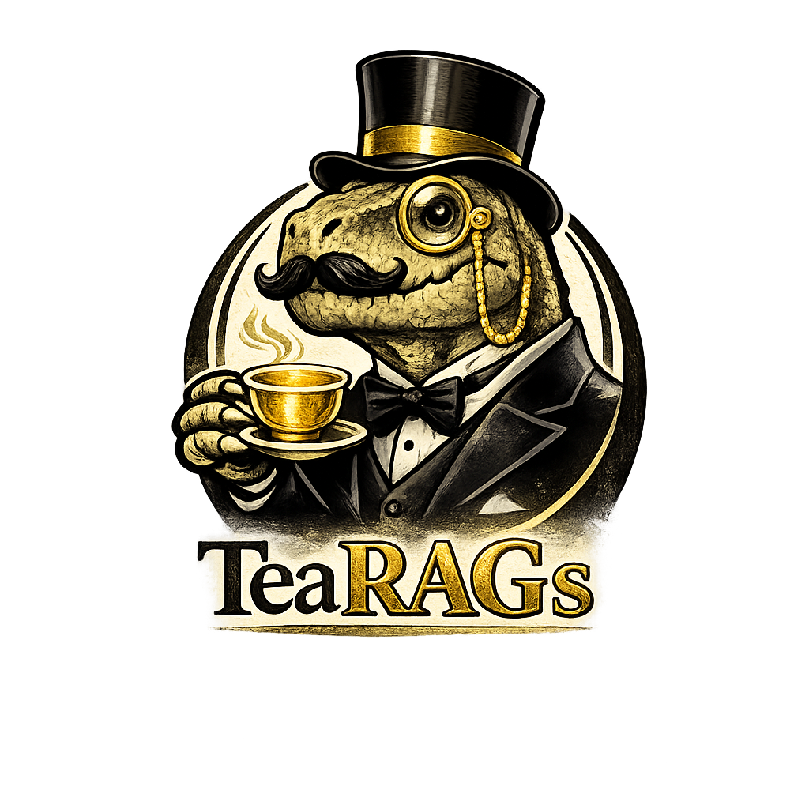

<p align="center">
  
</p>

<h1 align="center">TeaRAGs</h1>

<p align="center">
  <strong>Trajectory Enrichment-Aware RAG for Coding Agents</strong>
</p>


[](#-quick-start)
[](#-quick-start)
[](#-quick-start)
[](#-quick-start)

[](https://github.com/artk0de/TeaRAGs-MCP/actions/workflows/ci.yml)
[](https://codecov.io/gh/artk0de/TeaRAGs-MCP)

---

**MCP server** for semantic code search with **git trajectory reranking**. AST-aware chunking, incremental indexing, millions of LOC. Reranks results using authorship, churn, bug-fix rates, and 19 other signals — not just embedding similarity. Built on Qdrant. Works with Ollama (local) or cloud providers (OpenAI, Cohere, Voyage).

> 📖 **[Full documentation](https://artk0de.github.io/TeaRAGs-MCP/)** — 15-minute quickstart, agent workflows, architecture deep dives.

## 🧬 Trajectory Enrichment

Standard code RAG retrieves by similarity alone. **Trajectory enrichment** augments each chunk with signals about how code *evolves* — at the function level, not just file level.

- 🔀 **Git trajectory** — churn, authorship, volatility, bug-fix rates, task traceability. **19 signals** feed composable rerank presets (`hotspots`, `ownership`, `techDebt`, `securityAudit`...)
- 🕸️ **Topological trajectory** *(planned)* — symbol graphs, cross-file coupling, blast radius

Opt-in via `CODE_ENABLE_GIT_METADATA=true`. Without it — standard semantic search with AST-aware chunking.

> 💡 An agent can **find stable templates**, **avoid anti-patterns**, **match domain owner's style**, and **assess modification risk** — all backed by empirical data. [Read more →](https://artk0de.github.io/TeaRAGs-MCP/introduction/core-concepts)

## 🚀 Quick Start

```bash
git clone https://github.com/mhalder/qdrant-mcp-server.git
cd qdrant-mcp-server
npm install && npm run build

# Start Qdrant + Ollama
podman compose up -d
podman exec ollama ollama pull unclemusclez/jina-embeddings-v2-base-code:latest

# Add to Claude Code
claude mcp add tea-rags -s user -- node /path/to/tea-rags-mcp/build/index.js \
  -e QDRANT_URL=http://localhost:6333 \
  -e EMBEDDING_BASE_URL=http://localhost:11434
```

Then ask your agent: *"Index this codebase for semantic search"*

## 📚 Documentation

**[artk0de.github.io/TeaRAGs-MCP](https://artk0de.github.io/TeaRAGs-MCP/)**

| | Section | What's inside |
|---|---------|---------------|
| 🏁 | [Quickstart](https://artk0de.github.io/TeaRAGs-MCP/quickstart/installation) | Installation, first index & query |
| ⚙️ | [Configuration](https://artk0de.github.io/TeaRAGs-MCP/usage/configuration) | Env vars, providers, tuning |
| 🤖 | [Agent Integration](https://artk0de.github.io/TeaRAGs-MCP/agent-integration/search-strategies) | Prompt strategies, generation modes, deep analysis |
| 🏗️ | [Architecture](https://artk0de.github.io/TeaRAGs-MCP/architecture/overview) | Pipeline, data model, reranker internals |

## 🤝 Contributing

See [CONTRIBUTING.md](CONTRIBUTING.md) for workflow and conventions.

## 🙏 Acknowledgments

Built on a fork of **[mhalder/qdrant-mcp-server](https://github.com/mhalder/qdrant-mcp-server)** — clean architecture, solid tests, open-source spirit. And its ancestor **[qdrant/mcp-server-qdrant](https://github.com/qdrant/mcp-server-qdrant)**. Code vectorization inspired by **[claude-context](https://github.com/zilliztech/claude-context)** (Zilliz).

_Feel free to fork this fork. It's forks all the way down._ 🐢

## ⚖️ License

MIT — see [LICENSE](LICENSE). Brand policy in [BRAND.md](BRAND.md).
