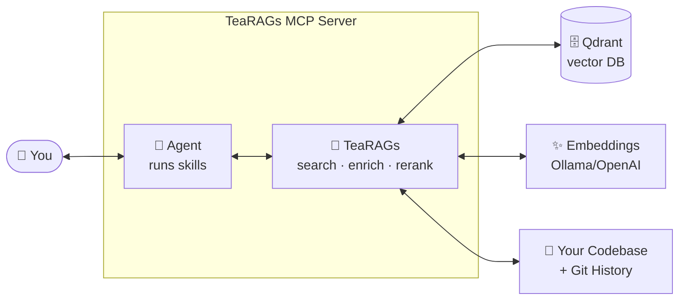

<p align="center">
  <a href="https://artk0de.github.io/TeaRAGs-MCP/">
    
  </a>
</p>

<h1 align="center">TeaRAGs 🦖🍵</h1>

<p align="center">
  <strong>Trajectory Enrichment-Aware RAG for Coding Agents</strong>
</p>

<p align="center">
  
  <a href="https://artk0de.github.io/TeaRAGs-MCP/quickstart/installation"></a>
  
  
  <br>
  <a href="https://github.com/artk0de/TeaRAGs-MCP/actions/workflows/ci.yml"></a>
  <a href="https://codecov.io/gh/artk0de/TeaRAGs-MCP"></a>
</p>

---

**Your coding agent copies the first code it finds — not the right one.**

TeaRAGs is an MCP server for code search that enriches every retrieved chunk
with git history: authorship, churn, bug-fix rate, ownership. Your agent stops
learning from hotspots and starts learning from **stable, owned, battle-tested
code**.

📖 **[Full documentation](https://artk0de.github.io/TeaRAGs-MCP/)** · 🏁
**[15-minute quickstart](https://artk0de.github.io/TeaRAGs-MCP/quickstart/installation)**
· 🧠
**[Core concepts](https://artk0de.github.io/TeaRAGs-MCP/introduction/core-concepts)**

## The Problem

### 1. Understanding a monorepo is expensive — for humans AND agents

Every new developer pays in hours. Every fresh agent session pays in tokens.
Naming conventions, domain logic, local idioms — all of it has to be rebuilt
from scratch, every time.

### 2. Bad code hygiene is a tax on your agent

Confusing names mean the agent reads more files. More files mean more tokens,
slower responses, and a higher chance of picking the wrong example. Your
codebase's technical debt is now your AI bill.

### 3. Agents can't tell stable code from a hotspot

Standard code search ranks by embedding similarity alone. It doesn't know which
function gets bug-fixed every sprint, which module hasn't been touched in two
years, or whose name is on the commits. So the agent copies whatever looks
similar — including the broken examples.

## The Solution

TeaRAGs gives your agent two things it can't get from vanilla code search.

### 1. Every chunk carries its own history

Retrieved code comes with signals about **who wrote it, how stable it is, how
often it gets bug-fixed**, and **how impactful a change would be**. Semantic
similarity stops being the whole answer — it becomes the floor.

### 2. Pre-built skills, not just raw tools

TeaRAGs ships agent **skills** — ready-made playbooks that tell your agent when
and how to use the signals. No prompt engineering required:

- `explore` — orient in an unfamiliar codebase
- `data-driven-generation` — write code backed by stable, owned templates
- `risk-assessment` — know what you'd break before you break it
- `refactoring-scan` · `bug-hunt` · `pattern-search` — and more

Install the plugin, your agent learns the workflow.
[See all skills →](https://artk0de.github.io/TeaRAGs-MCP/usage/skills/)

## Use Cases

### 🛡️ Safe code generation

Your agent writes new code backed by **stable, canonical templates** — modules
with a low bug-fix rate, long stability, and a clear owner. No more copying from
last sprint's hotspot. _Skill: `data-driven-generation` ·
[Why stable code is safer →](https://artk0de.github.io/TeaRAGs-MCP/knowledge-base/code-churn-research)_

### 🔧 Refactoring planning & problem-pattern discovery

Find the 5% of code responsible for 80% of incidents. **High churn + high
bug-fix rate + concentrated ownership = your next production issue** — and your
next refactoring candidate. _Skills: `refactoring-scan`, `bug-hunt`_

### 🎯 Risk assessment before changes

Before modifying a function, the agent checks **who depends on it, how often it
breaks, and what its ticket history says**. Know the blast radius before you
blast. _Skill: `risk-assessment` ·
[Coupling & blast radius theory →](https://artk0de.github.io/TeaRAGs-MCP/knowledge-base/code-quality-metrics)_

### 🗺️ Learning an unfamiliar codebase

Ask questions instead of reading directory trees. _"How does auth work?"_
returns the **stable, canonical implementation** with its history attached — not
a random similar-looking snippet. _Skill: `explore`_

## How It Works



You talk to your agent. The agent runs a TeaRAGs skill. TeaRAGs searches your
code, enriches each result with git history, and ranks by what the skill needs —
stability, ownership, risk, or pure relevance.

## What You Get

- 🧬 **Trajectory-aware retrieval** — the only open-source code RAG that scores
  results by git history, not just embedding similarity
- 📚 **Ships with agent skills** — 6 ready-made playbooks for exploration,
  generation, risk assessment, and index management (plus 2 internal strategies)
- 🔒 **Local-first, privacy-first** — works fully offline with Ollama; your code
  never leaves your machine (cloud providers optional)
- 🚀 **Built for monorepos** — AST-aware chunking across 10+ languages,
  incremental reindexing, parallel pipelines, millions of LOC tested

## Who It's For

- **Developers in large monorepos** — where "find similar code" returns a dozen
  near-duplicates and you need the _canonical_ one
- **Solo devs doing agentic development** — agent-driven workflows produce
  bursts of micro-commits that wreck churn metrics. TeaRAGs ships a
  [**GIT SESSIONS**](https://artk0de.github.io/TeaRAGs-MCP/architecture/git-enrichment-pipeline#git-sessions)
  mode (`TRAJECTORY_GIT_SQUASH_AWARE_SESSIONS=true`) that groups commits by
  `(author, time gap)` so a 20-commit refactor session counts as **one**. Churn,
  bug-fix rate, and ownership stay meaningful even with a single human + an
  agent as the only contributors.
- **Tech leads worried about AI code quality** — who want their team's agents to
  learn from stable modules, not from last sprint's hotspot
- **Privacy-sensitive teams** — finance, healthcare, defense, or anyone who
  can't send source code to a cloud API

**Not for:** repos without git history (no signal to enrich) or teams that only
need autocomplete (use Copilot).

## 🚀 Quick Start

Inside **Claude Code**, install the TeaRAGs plugins and run the setup wizard:

```
/plugin marketplace add artk0de/TeaRAGs-MCP
/plugin install tea-rags-setup@tea-rags
/tea-rags-setup:install
```

Then install the skills plugin (Claude-only, final step):

```
/plugin install tea-rags@tea-rags
```

Index your codebase:

```
/tea-rags:index
```

Ask your agent anything: _"How does auth work in this project?"_, _"Find stable
examples of retry logic"_, _"What should I know before touching the payment
module?"_.

For other MCP clients, CI, or air-gapped setups, see the
[manual install](https://artk0de.github.io/TeaRAGs-MCP/quickstart/installation#option-b--manual-install)
(Node + `npm install -g tea-rags` + Ollama/ONNX/OpenAI/Cohere/Voyage).

## 📚 Documentation

**[artk0de.github.io/TeaRAGs-MCP](https://artk0de.github.io/TeaRAGs-MCP/)**

| I want to…                   | Start here                                                                                                                          |
| ---------------------------- | ----------------------------------------------------------------------------------------------------------------------------------- |
| **Get it running**           | [Quickstart (15 min)](https://artk0de.github.io/TeaRAGs-MCP/quickstart/installation) — install, index, first query                  |
| **Understand the concept**   | [Core Concepts](https://artk0de.github.io/TeaRAGs-MCP/introduction/core-concepts) — vectorization, trajectory enrichment, reranking |
| **See what my agent can do** | [Skills](https://artk0de.github.io/TeaRAGs-MCP/usage/skills/) — 6 ready-made agent playbooks for exploration, generation, risk      |
| **Look under the hood**      | [Architecture](https://artk0de.github.io/TeaRAGs-MCP/architecture/overview) — pipelines, data model, reranker internals             |
| **Learn the theory**         | [Knowledge Base](https://artk0de.github.io/TeaRAGs-MCP/knowledge-base/rag-fundamentals) — RAG, code search, software evolution      |

## 🤝 Contributing

See [CONTRIBUTING.md](CONTRIBUTING.md) for workflow and conventions.

## 🙏 Acknowledgments

Built on a fork of
**[mhalder/qdrant-mcp-server](https://github.com/mhalder/qdrant-mcp-server)** —
clean architecture, solid tests, open-source spirit. And its ancestor
**[qdrant/mcp-server-qdrant](https://github.com/qdrant/mcp-server-qdrant)**.
Code vectorization inspired by
**[claude-context](https://github.com/zilliztech/claude-context)** (Zilliz).

_Feel free to fork this fork. It's forks all the way down._ 🐢

## ⚖️ License

MIT — see [LICENSE](LICENSE). Brand policy in [BRAND.md](BRAND.md).
