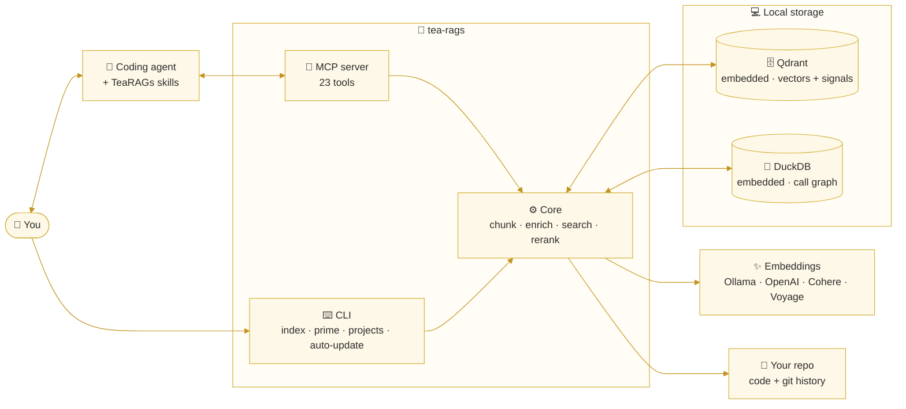

<p align="center">
  <a href="https://artk0de.github.io/TeaRAGs-MCP/">
    
  </a>
</p>

<h1 align="center">TeaRAGs 🦖🍵</h1>

<p align="center">
  <strong>Codebase Intelligence layer for AI coding agents</strong><br>
  <sub>Trajectory Enrichment-Aware RAG · served over MCP · 100% local</sub>
</p>

<p align="center">
  <a href="https://www.npmjs.com/package/tea-rags"></a>
  <a href="https://github.com/artk0de/TeaRAGs-MCP/actions/workflows/ci.yml"></a>
  <a href="https://codecov.io/gh/artk0de/TeaRAGs-MCP"></a>
  <a href="LICENSE"></a>
</p>

---

**Your coding agent copies the first code it finds — not the right one.**

TeaRAGs is a **Codebase Intelligence layer** your agent queries over MCP. It
indexes the repository on your machine and returns every piece of code with
three views of it:

- 🔍 **What it does** — semantic and hybrid search over AST-aware chunks
- 🕸️ **How it is connected** — callers, callees, fan-in, transitive impact
- 🧬 **How it has lived** — churn, bug-fix rate, ownership, age

…and ships agent skills that know which view a task needs. The agent stops
guessing which code is safe to copy, what is critical, and what a change will
break — it reads the dossier instead.

📖 **[Documentation](https://artk0de.github.io/TeaRAGs-MCP/)** · 🏁
**[15-minute quickstart](https://artk0de.github.io/TeaRAGs-MCP/quickstart/installation)**
· 🧠
**[Core concepts](https://artk0de.github.io/TeaRAGs-MCP/introduction/core-concepts)**

## 👀 See It

Three questions an agent asks before touching code, answered by TeaRAGs on its
own repository. Every number below is a real response, trimmed.

### 1. "Find retry logic I can reuse"

`semantic_search { query: "retry a failed request with exponential backoff", rerank: "hotspots" }`

Similarity alone puts `OllamaEmbeddings#retryWithBackoff` first. The dossiers of
the top two candidates tell different stories:

|                           | 🥇 `OllamaEmbeddings#retryWithBackoff` | 🥈 `DeletionRetryHelper#execute` |
| ------------------------- | -------------------------------------- | -------------------------------- |
| Similarity rank           | #1                                     | #2 (`retry-helper.ts`)           |
| Commits to the file       | 28                                     | 1                                |
| Share that were bug fixes | 54% · 🔴 _concerning_                  | 0% · 🟢 _healthy_                |
| Last changed              | 2 days ago · _recent_                  | 86 days ago · _old_              |
| Callers                   | 2                                      | 1                                |

The closest match keeps getting fixed. The agent copies the quiet helper's shape
— or learns why the first one keeps breaking before it repeats the mistake.

<details>
<summary>Raw response for the first hit (trimmed)</summary>

```json
{
  "symbolId": "OllamaEmbeddings#retryWithBackoff",
  "relativePath": "src/core/adapters/embeddings/ollama.ts",
  "startLine": 290,
  "endLine": 378,
  "preset": "hotspots",
  "git": {
    "file": {
      "commitCount": 28,
      "ageDays": { "value": 2, "label": "recent" },
      "bugFixRate": { "value": 54, "label": "concerning" },
      "relativeChurn": { "value": 2.55, "label": "normal" }
    },
    "chunk": {
      "commitCount": { "value": 11, "label": "extreme" },
      "relativeChurn": { "value": 9.09, "label": "high" }
    }
  },
  "codegraph": { "symbols": { "chunk": { "fanIn": 2, "fanOut": 6 } } }
}
```

Labels are computed from **this repository's own percentiles**, so _extreme_
means extreme for this codebase, not for some global average.

</details>

### 2. "What is risky to touch around vector writes?"

`semantic_search { query: "write points to the vector database in batches", rerank: "dangerous" }`

Similarity alone ranks `PointsAccumulator#flushBatch`,
`QdrantPointStore#addPointsOptimized` and `QdrantPointStore#addPoints` first.
The `dangerous` preset reorders by risk and says why:

| #   | Ranked by risk                               | Why it moved up                                                             |
| --- | -------------------------------------------- | --------------------------------------------------------------------------- |
| 1   | `ChunkPipeline#createBatchHandler`           | 16 outgoing calls, 77 lines, 5 commits · _high_                             |
| 2   | `QdrantManager#addPointsWithSparseOptimized` | file with 45 commits, relative churn 8.09 · 🔴 _high_, 4 authors            |
| 3   | `PointsAccumulator#flushBatch`               | one author owns 100% of the live lines · 🟠 _deep-silo_, 158 days untouched |

### 3. "Who calls it before I change it?"

`get_callers { symbolId: "QdrantManager#addPointsWithSparse" }`

Ten exact call sites across eight files — method fan-in 10 · _central_, file
transitive impact 47 · _regional_:

```text
ChunkPipeline#createBatchHandler          ingest/pipeline/chunk-pipeline.ts
createQdrantPipeline                      ingest/pipeline/pipeline-manager.ts
storeIndexingMarker (2 sites)             ingest/pipeline/indexing-marker.ts
DocumentOps#add                           api/internal/ops/document-ops.ts
SchemaManager#storeSchemaMetadata         adapters/qdrant/schema-manager.ts
EmbeddingModelGuard#readOrCreateMarker    adapters/qdrant/embedding-model-guard.ts
IndexStoreAdapter#storeSchemaVersion      maintenance/migration/adapters/index-store-adapter.ts
SparseStoreAdapter#rebuildSparseVectors   maintenance/migration/adapters/sparse-store-adapter.ts
SparseStoreAdapter#storeSparseVersion     maintenance/migration/adapters/sparse-store-adapter.ts
```

Need the whole chain from an entry point to this call? `trace_path` enumerates
every A→B path and, with a rerank preset, sorts them by how dangerous each step
is.

## ❓ What It Answers

Ask in plain language. **The plugin picks the skill, tools and rerank presets
for every question automatically** — it ships a decision table that maps intent
to the right call, so nobody has to know a preset name. Other MCP clients get
the same routing guide as an MCP resource (`tea-rags://schema/search-guide`).
The right column shows what runs under the hood.

### 🗺️ Understand

| Ask your agent                                                           | What runs                                                                    |
| ------------------------------------------------------------------------ | ---------------------------------------------------------------------------- |
| _"Where do we charge a bill with a saved card, and what will it touch?"_ | `hybrid_search` with `blastRadius` — the service, its neighbours, its reach  |
| _"Onboard me into billing — where are the entry points?"_                | `/tea-rags:explore` · `onboarding`, `entryPoint`, outlines via `find_symbol` |
| _"Which modules is this whole app built around?"_                        | `architecturalHub` · `hotMethod` · `hubs` filter                             |
| _"What was done under ticket #4521?"_                                    | `taskId` filter                                                              |

### ♻️ Reuse and generate

| Ask your agent                                                          | What runs                                                                            |
| ----------------------------------------------------------------------- | ------------------------------------------------------------------------------------ |
| _"Add partial payments to bill payment — in our style, no duplicates."_ | `/tea-rags:data-driven-generation` — proven template, reuse gate, placement, callers |
| _"We have four payment-gateway retries. Which one should I copy?"_      | `proven` — long-lived, stable, low-bug, multi-author · `battleTested` filter         |
| _"Is there already a helper that rounds money amounts?"_                | `/tea-rags:pattern-search` · `find_similar`                                          |

### 🎯 Change safely

| Ask your agent                                                                                      | What runs                                                                                                                               |
| --------------------------------------------------------------------------------------------------- | --------------------------------------------------------------------------------------------------------------------------------------- |
| _"What should I not touch in this task, and where is it safer to build a parallel implementation?"_ | `criticalPath` · `blastRadius` · `godModule`; `/tea-rags:data-driven-generation` proposes a separate home when the target is overloaded |
| _"Who calls bill payment, and how does a request get from the API to the card charge?"_             | `get_callers` · `trace_path` with `dangerous` — the riskiest step first                                                                 |
| _"Which code here should never change without a second reviewer?"_                                  | `criticalPath` · `criticalMethod` · `panicZone`, `unstableCore`, `hubs` filters                                                         |
| _"Which tests cover the behaviour I'm about to change?"_                                            | `/tea-rags:tests-as-context`                                                                                                            |

### 🐛 Find problems

| Ask your agent                                                                     | What runs                                                                                                                  |
| ---------------------------------------------------------------------------------- | -------------------------------------------------------------------------------------------------------------------------- |
| _"Where are the most dangerous modules in the payments domain?"_                   | `/tea-rags:risk-assessment` — `bugHunt`, `hotspots`, `techDebt`, `dangerous`, `criticalPath` in one pass, plus god modules |
| _"After a retry, a bill gets marked as paid twice. What is most likely to blame?"_ | `/tea-rags:bug-hunt` — the ticket text as the query, `bugHunt`, then `get_callers` / `trace_path`                          |
| _"Map the tech debt in invoicing."_                                                | `techDebt` · `refactoring` · `decomposition` · `godModule` · `godMethod`                                                   |
| _"Which files in this domain changed most this month?"_                            | `rank_chunks` with `hotspots` and a `modifiedAfter` filter                                                                 |
| _"What here is dead or abandoned?"_                                                | `deadCandidates` · `abandonedHotspots` filters                                                                             |

### 👥 Review, ownership and audit

| Ask your agent                                                | What runs                                                                   |
| ------------------------------------------------------------- | --------------------------------------------------------------------------- |
| _"What in this merge request should I look at first?"_        | `/tea-rags:mr-review` — risk signals over the diff, callers of every change |
| _"Whose code is this, and where is the bus factor one?"_      | `ownership` · `fragileSilo` filter                                          |
| _"Which old security-critical code is overdue for an audit?"_ | `securityAudit` · `securityPaths` filter                                    |

## ✨ Features

- 📈 **Git- and codegraph-aware ranking** — 23 rerank presets blend churn,
  bug-fix rate, ownership and age with fan-in, PageRank and transitive impact
  (`proven`, `hotspots`, `techDebt`, `blastRadius`, `criticalPath`, …), plus 12
  filter presets
- 🕸️ **Call graph** — callers, callees, cycles and A→B paths (`get_callers`,
  `get_callees`, `find_cycles`, `trace_path`) for TypeScript, JavaScript, Python
  and Ruby at a high tier
- 🧠 **Agent skills** — the plugin routes every question to the right tools and
  presets on its own; 14 ready-made workflows (`explore`, `bug-hunt`,
  `risk-assessment`, `data-driven-generation`, `mr-review`, …) plus
  [`dinopowers`](https://artk0de.github.io/TeaRAGs-MCP/usage/skills/#dinopowers--wrappers-over-superpowers),
  10 wrappers that feed index signals into
  [`superpowers`](https://github.com/obra/superpowers)
- 🔒 **100% local** — embedded Qdrant and DuckDB, no Docker; embeddings through
  Ollama, with OpenAI, Cohere and Voyage optional
- 🔄 **Always fresh** — incremental reindex, auto-update on a target branch,
  per-worktree index clones, and a drift report that names the exact command to
  run
- 🏢 **Built for enterprise monorepos** — AST chunking for 9 languages, parallel
  pipelines, validated on a 3.5M-line production monolith

## 📦 Installation

### 💻 System requirements

|                | Requirement                                                                                             |
| -------------- | ------------------------------------------------------------------------------------------------------- |
| **OS**         | macOS (arm64, x64) · Linux (x64, arm64) · Windows (x64)                                                 |
| **Node.js**    | 22+ supported, 24+ recommended                                                                          |
| **git**        | Required — churn, ownership and bug-fix signals come from the repository's history                      |
| **Embeddings** | [Ollama](https://ollama.com) with the code-embedding model (322 MB), or an OpenAI, Cohere or Voyage key |
| **Disk**       | 66 MB for the Qdrant binary, plus the per-project indexes below                                         |

Disk taken by real indexes (turbo quantization, dense + sparse vectors):

| Codebase                                | Indexed                                                     | Vector index (Qdrant) | Call graph (DuckDB) |
| --------------------------------------- | ----------------------------------------------------------- | --------------------- | ------------------- |
| Production monolith (Ruby + TypeScript) | **3M+ LoC + 118K lines of docs** · ~33k files · 140k chunks | 1.3 GB                | 1.1 GB              |
| TeaRAGs itself (TypeScript)             | 433K LoC + 36K lines of docs · ~2.4k files · 25k chunks     | 1.2 GB                | 42 MB               |

The call graph grows with the code; the vector index barely does — a codebase
seven times smaller still takes 1.2 GB.

Pull the code-embedding model:

```bash
ollama pull unclemusclez/jina-embeddings-v2-base-code:latest
```

**Claude Code** — plugins plus a setup wizard that detects your hardware and
tunes the pipeline:

```text
/plugin marketplace add artk0de/TeaRAGs-MCP
/plugin install tea-rags-setup@tea-rags
/tea-rags-setup:install
/plugin install tea-rags@tea-rags
```

**Any MCP client** (Cursor, Roo Code, Continue, …):

```bash
npm install -g tea-rags
```

```json
{
  "mcpServers": {
    "tea-rags": {
      "command": "tea-rags",
      "args": ["server"],
      "env": { "CODEGRAPH_ENABLED": "true" }
    }
  }
}
```

Qdrant downloads and starts on first use. Cloud embeddings (OpenAI, Cohere,
Voyage), an external Qdrant, and the built-in ONNX provider (beta) are covered
in the
[installation guide](https://artk0de.github.io/TeaRAGs-MCP/quickstart/installation).

### 🕸️ Enable the call graph

The call graph is **off by default** while it is in beta. Turn it on with
`CODEGRAPH_ENABLED=true` in the MCP server's environment — the JSON above
already does — or, in Claude Code:

```bash
claude mcp add tea-rags -s user -e CODEGRAPH_ENABLED=true -- tea-rags server
```

Then reindex. The flag is recorded per project, so later runs from the CLI or
auto-update keep the graph on. Details:
[Codegraph Enrichments](https://artk0de.github.io/TeaRAGs-MCP/usage/advanced/codegraph-enrichments).

## 🚀 Quick Start

```bash
tea-rags index-codebase /path/to/repo --name myrepo   # first index: register + index
tea-rags prime /path/to/repo                          # index state, drift, signal thresholds
```

In Claude Code, `/tea-rags:index` does the same. Then ask your agent:

- _"How does auth work in this project?"_
- _"Find stable examples of retry logic I can copy."_
- _"What breaks if I change the payment module?"_

## 🤔 Why TeaRAGs?

|                              | `grep` / `ripgrep` | Embedding search | **TeaRAGs**                                           |
| ---------------------------- | ------------------ | ---------------- | ----------------------------------------------------- |
| **Finds**                    | Exact text         | Similar code     | Similar code, ranked by evidence                      |
| **Knows history**            | —                  | —                | Churn, bug fixes, owners, age                         |
| **Knows callers**            | —                  | —                | Fan-in, transitive impact, call paths                 |
| **Ranks for the task**       | —                  | Similarity only  | 23 presets — see [What It Answers](#-what-it-answers) |
| **Cost on a large monorepo** | Many agent turns   | One query        | One query                                             |

## ⚙️ How It Works


```mermaid
%%{init: {"theme": "base", "themeVariables": {"primaryColor": "#fdf8e7", "primaryTextColor": "#2d2d2d", "primaryBorderColor": "#d4af37", "lineColor": "#c4941f", "secondaryColor": "#f5f5dc", "tertiaryColor": "#fafafa", "mainBkg": "#fdf8e7", "secondBkg": "#f5f5dc", "nodeBorder": "#d4af37", "clusterBkg": "#fffdf6", "clusterBorder": "#d4af37", "titleColor": "#2d2d2d", "edgeLabelBackground": "#ffffff", "fontSize": "15px"}}}%%
flowchart LR
    User([👤 You])
    Agent[🤖 Coding agent<br/>+ TeaRAGs skills]

    subgraph pkg["🍵 tea-rags"]
        MCP[🔌 MCP server<br/>23 tools]
        CLI[⌨️ CLI<br/>index · prime · projects · auto-update]
        Core[⚙️ Core<br/>chunk · enrich · search · rerank]
        MCP --> Core
        CLI --> Core
    end

    subgraph storage["💻 Local storage"]
        Qdrant[(🗄️ Qdrant<br/>embedded · vectors + signals)]
        DuckDB[(🦆 DuckDB<br/>embedded · call graph)]
    end

    Embeddings[✨ Embeddings<br/>Ollama · OpenAI · Cohere · Voyage]
    Repo[📁 Your repo<br/>code + git history]

    User <--> Agent
    Agent <--> MCP
    User --> CLI
    Core <--> Qdrant
    Core <--> DuckDB
    Core --> Embeddings
    Core --> Repo
```

Your agent calls TeaRAGs over MCP; you run the CLI to index and maintain. Both
drive one core: it chunks code on AST boundaries, embeds each chunk, attaches
git and call-graph signals, and ranks results by the preset the task asks for.
Qdrant and DuckDB run embedded under `~/.tea-rags` — no Docker, no servers to
manage.

## 📏 Measured

Call-graph quality is checked against independent oracles, not eyeballed.

| What                                                        | Result                                 | Corpus                             |
| ----------------------------------------------------------- | -------------------------------------- | ---------------------------------- |
| 🐍 Python call graph vs. jedi + pyright (pyright tie-break) | recall 0.92–1.00 · wrong edges ≤ 0.29% | flask, httpx, netbox, polar        |
| 💎 Ruby call graph, YARD-annotated                          | in-project recall 1.00 · 0 fabricated  | octokit.rb                         |
| 💎 Ruby call graph, un-annotated Rails                      | bare-call recall 0.93                  | mastodon                           |
| 💎 Ruby call graph, production Rails                        | in-project recall 87.7%                | 3.5M-line production monolith      |
| 🟦 TypeScript call graph vs. the TypeScript type checker    | phantom edges 0.32% · agreement 72.8%¹ | 17k-file production React frontend |
| 🟦 TypeScript call graph on TeaRAGs' own source             | fabricated edges 93 → 0                | tea-rags `src/`                    |
| 🧠 `dinopowers` wrappers vs. plain `superpowers` skills     | +71 pp mean pass rate                  | 136 eval cases, 10 wrappers        |
| 🩹 Healing a drifted index instead of recomputing it        | 113 ms                                 | 134k-point production index        |

¹ About two thirds of the TypeScript gap is callbacks passed through props and
dependency injection — the type checker names a function type there, not an
implementation, so no static resolver can pin those edges.

The Python oracle harness ships in the repo
(`scripts/py-codegraph-jedi-oracle.ts`), so those numbers can be reproduced on
your own corpus.

<!-- BEGIN lang-compat -->

## Languages Compatibilities

<!-- markdownlint-disable MD033 -->
<details>
<summary>🌗 Supported languages & support levels</summary>

**Support:** 🌕 maximum · 🌔 full · 🌖 high · 🌓 medium · 🌗 moderate · 🌒
partial/low · 🌘 minimal · 🌑 none

What tea-rags supports per language and at what level. `AST chunking` is how
source is split into searchable chunks; `Test chunking` is how faithfully test
structure is preserved; `Codegraph` is the call-graph resolution ceiling (the
realized per-project number lives in the `tea-rags prime` digest, not here).
Rows are ordered by overall capability, richest support first.

| Language         | AST chunking                                                                                                      | Test chunking                                             | Codegraph                                                                                                                                                                                   |
| ---------------- | ----------------------------------------------------------------------------------------------------------------- | --------------------------------------------------------- | ------------------------------------------------------------------------------------------------------------------------------------------------------------------------------------------- |
| **_TypeScript_** | 🌔 **full** · tree-sitter (comment attachment, method-body splitting, describe/it scopes)                         | 🌖 **high** · testScopeChunker (describe/it scopes)       | 🌖 **high** — 14-strategy chain (10 tree-sitter + 4 ts.Program/typeChecker) + cone dispatch + typeChecker-backed union-receiver fan-out                                                     |
| **_JavaScript_** | 🌔 **full** · tree-sitter (assignment chunking, module/class split)                                               | 🌖 **high** · testScopeChunker (describe/it scopes)       | 🌖 **high** — 6-strategy; CommonJS/ESM require resolution (dynamic gaps)                                                                                                                    |
| **_Ruby_**       | 🌔 **full** · tree-sitter (RSpec block grouping, comment attachment, spec scope splitting, method-body splitting) | 🌖 **high** · RSpec scope chunker (parent setup injected) | untyped 🌖 **high** · YARD 🌕 **maximum** · RBS/Sorbet 🌑 **TBD** — 15-strategy chain + 4 dispatch components + 20-grammar DSL catalogue + YARD type-source + db/schema.rb column accessors |
| **_Python_**     | 🌔 **full** · tree-sitter                                                                                         | 🌓 **medium** · generic AST                               | 🌖 **high** — 9-strategy chain + C3 MRO + CHA cone dispatch + re-export-aware import mapping + annotation, docstring and return-type facts                                                  |
| **_Go_**         | 🌔 **full** · tree-sitter (func/type split)                                                                       | 🌓 **medium** · generic AST                               | 🌗 **moderate** — 7-pass chain + scope-aware typed locals + struct-field chains + embedding promotion + go.mod module-path imports; no interface dispatch                                   |
| **_Java_**       | 🌔 **full** · tree-sitter                                                                                         | 🌓 **medium** · generic AST                               | 🌗 **moderate** — 6-strategy + java.lang stdlib whitelist + overload disambiguation                                                                                                         |
| **_Rust_**       | 🌔 **full** · tree-sitter (named-item extraction)                                                                 | 🌓 **medium** · generic AST (#[test] attrs not preserved) | 🌗 **moderate** — 6-strategy; trait-based dispatch                                                                                                                                          |
| **_Bash_**       | 🌔 **full** · tree-sitter                                                                                         | 🌒 **low** · generic AST (bats/shunit not recognized)     | 🌘 **minimal** — function-call extraction only, no dispatch                                                                                                                                 |
| **_Markdown_**   | 🌔 **full** · MarkdownChunker (ToC + smart chunking)                                                              | 🌑 **N/A** · doc-only                                     | 🌑 **none** — no call graph                                                                                                                                                                 |
| **_sql_**        | 🌑 **none** · CharacterChunker                                                                                    | 🌑 **N/A**                                                | 🌑 **none**                                                                                                                                                                                 |
| **_jsonc_**      | 🌑 **none** · CharacterChunker                                                                                    | 🌑 **N/A**                                                | 🌑 **none**                                                                                                                                                                                 |
| **_json_**       | 🌑 **none** · CharacterChunker                                                                                    | 🌑 **N/A**                                                | 🌑 **none**                                                                                                                                                                                 |

</details>
<!-- markdownlint-enable MD033 -->
<!-- END lang-compat -->

## ⌨️ CLI

| Command                   | What it does                                                        |
| ------------------------- | ------------------------------------------------------------------- |
| `tea-rags index-codebase` | Index or incrementally update a codebase, with live progress        |
| `tea-rags prime`          | Markdown digest of index state, drift and signal thresholds         |
| `tea-rags projects`       | Manage the project registry: `register`, `list`, `info`, `prune`, … |
| `tea-rags auto-update`    | Keep a project's index fresh on its target branch                   |
| `tea-rags worktree`       | Per-worktree index clones for parallel branches                     |
| `tea-rags doctor`         | Infrastructure and registry health                                  |
| `tea-rags tune`           | Auto-tune performance parameters for your hardware                  |
| `tea-rags update`         | Check for and install a newer version                               |
| `tea-rags server`         | Start the MCP server                                                |

## 📚 Documentation

| I want to…                   | Start here                                                                                                                                                        |
| ---------------------------- | ----------------------------------------------------------------------------------------------------------------------------------------------------------------- |
| **Get it running**           | [Quickstart](https://artk0de.github.io/TeaRAGs-MCP/quickstart/installation) — install, index, first query                                                         |
| **Understand the concept**   | [Core Concepts](https://artk0de.github.io/TeaRAGs-MCP/introduction/core-concepts) — vectorization, trajectory enrichment, reranking                               |
| **See what my agent can do** | [Skills](https://artk0de.github.io/TeaRAGs-MCP/usage/skills/) — the agent workflows and when each one fires                                                       |
| **Keep the index fresh**     | [Auto-Update](https://artk0de.github.io/TeaRAGs-MCP/operations/auto-update) · [Drift Detection](https://artk0de.github.io/TeaRAGs-MCP/operations/drift-detection) |
| **Look under the hood**      | [Architecture](https://artk0de.github.io/TeaRAGs-MCP/architecture/overview) — pipelines, data model, reranker internals                                           |
| **Learn the theory**         | [Knowledge Base](https://artk0de.github.io/TeaRAGs-MCP/knowledge-base/rag-fundamentals) — RAG, code search, software evolution                                    |

## 📝 From the Blog

Engineering notes behind the releases, each with the corpus it was measured on —
[all posts](https://artk0de.github.io/TeaRAGs-MCP/blog) ·
[RSS](https://artk0de.github.io/TeaRAGs-MCP/blog/rss.xml).

<!-- BLOG:START -->

- [Why this blog exists — 2026-08-19](https://artk0de.github.io/TeaRAGs-MCP/blog/why-this-blog-exists)

<!-- BLOG:END -->

## 🤝 Contributing

See [CONTRIBUTING.md](CONTRIBUTING.md) for workflow and conventions.

## 🙏 Acknowledgments

Started as a fork of
**[mhalder/qdrant-mcp-server](https://github.com/mhalder/qdrant-mcp-server)** —
clean architecture, solid tests, open-source spirit — and its ancestor
**[qdrant/mcp-server-qdrant](https://github.com/qdrant/mcp-server-qdrant)**.
Code vectorization inspired by
**[claude-context](https://github.com/zilliztech/claude-context)** (Zilliz).

_Feel free to fork this fork. It's forks all the way down._ 🐢

## ⚖️ License

MIT — see [LICENSE](LICENSE). Brand policy in [BRAND.md](BRAND.md).
