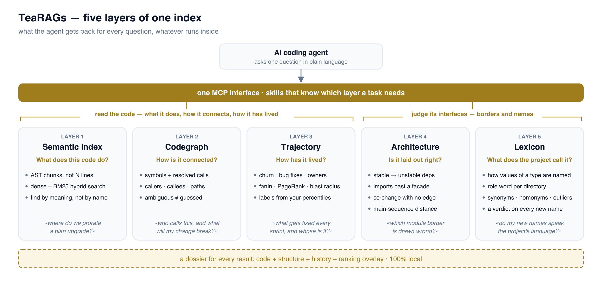
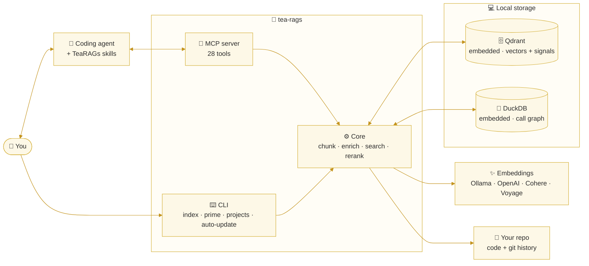
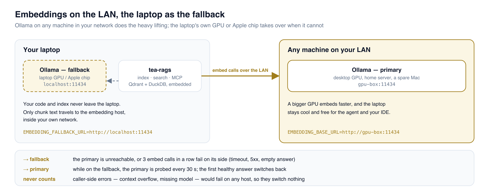

<p align="center">
  <a href="https://artk0de.github.io/TeaRAGs-MCP/">
    
  </a>
</p>

<h1 align="center">TeaRAGs 🦖🍵</h1>

<p align="center">
  <strong>Codebase Intelligence layer for AI coding agents</strong><br>
  <sub>Trajectory Enrichment-Aware RAG · served over MCP · 100% local</sub>
</p>

<p align="center">
  <a href="https://www.npmjs.com/package/tea-rags"></a>
  <a href="https://www.npmjs.com/package/tea-rags"></a>
  <a href="https://github.com/artk0de/TeaRAGs-MCP/actions/workflows/ci.yml"></a>
  <a href="https://codecov.io/gh/artk0de/TeaRAGs-MCP"></a>
  <a href="LICENSE"></a>
</p>

---

**Your coding agent copies the first code it finds — not the right one.**

TeaRAGs is a **Codebase Intelligence layer** your agent queries over MCP. It
indexes the repository on your machine into five layers — three that read the
code and two that judge its interfaces:

- 🔍 **What it does** — semantic and hybrid search over AST-aware chunks
- 🕸️ **How it is connected** — callers, callees, fan-in, transitive impact
- 🧬 **How it has lived** — churn, bug-fix rate, ownership, age
- 🏛️ **Whether it is laid out right** — dependency direction, leaking facades,
  files that change together with no edge between them
- 🔤 **What the project calls things** — the naming vocabulary, inferred from
  the call graph, and a verdict on every new name

<p align="center">
  
</p>

The first three layers and why an agent needs all of them at once are laid out
in [Codebase Intelligence для агента](https://habr.com/ru/articles/1084028/)
(Habr, in Russian).

TeaRAGs also ships agent skills that know which layer a task needs. The agent
stops guessing which code is safe to copy, what is critical, and what a change
will break — it reads the dossier instead.

📖 **[Documentation](https://artk0de.github.io/TeaRAGs-MCP/)** · 🏁
**[15-minute quickstart](https://artk0de.github.io/TeaRAGs-MCP/quickstart/installation)**
· 🧠
**[Core concepts](https://artk0de.github.io/TeaRAGs-MCP/introduction/core-concepts)**

## 👀 See It

Three questions an agent asks before touching code, answered by TeaRAGs on its
own repository. Every number below is a real response, trimmed.

### 1. "Find retry logic I can reuse"

`semantic_search { query: "retry a failed request with exponential backoff", rerank: "hotspots" }`

Similarity alone puts `OllamaEmbeddings#retryWithBackoff` first. The dossiers of
the top two candidates tell different stories:

|                           | 🥇 `OllamaEmbeddings#retryWithBackoff` | 🥈 `DeletionRetryHelper#execute` |
| ------------------------- | -------------------------------------- | -------------------------------- |
| Similarity rank           | #1                                     | #2 (`retry-helper.ts`)           |
| Commits to the file       | 28                                     | 1                                |
| Share that were bug fixes | 54% · 🔴 _concerning_                  | 0% · 🟢 _healthy_                |
| Last changed              | 2 days ago · _recent_                  | 86 days ago · _old_              |
| Callers                   | 2                                      | 1                                |

The closest match keeps getting fixed. The agent copies the quiet helper's shape
— or learns why the first one keeps breaking before it repeats the mistake.

<details>
<summary>Raw response for the first hit (trimmed)</summary>

```json
{
  "symbolId": "OllamaEmbeddings#retryWithBackoff",
  "relativePath": "src/core/adapters/embeddings/ollama.ts",
  "startLine": 290,
  "endLine": 378,
  "preset": "hotspots",
  "git": {
    "file": {
      "commitCount": 28,
      "ageDays": { "value": 2, "label": "recent" },
      "bugFixRate": { "value": 54, "label": "concerning" },
      "relativeChurn": { "value": 2.55, "label": "normal" }
    },
    "chunk": {
      "commitCount": { "value": 11, "label": "extreme" },
      "relativeChurn": { "value": 9.09, "label": "high" }
    }
  },
  "codegraph": { "symbols": { "chunk": { "fanIn": 2, "fanOut": 6 } } }
}
```

Labels are computed from **this repository's own percentiles**, so _extreme_
means extreme for this codebase, not for some global average.

</details>

### 2. "What is risky to touch around vector writes?"

`semantic_search { query: "write points to the vector database in batches", rerank: "dangerous" }`

Similarity alone ranks `PointsAccumulator#flushBatch`,
`QdrantPointStore#addPointsOptimized` and `QdrantPointStore#addPoints` first.
The `dangerous` preset reorders by risk and says why:

| #   | Ranked by risk                               | Why it moved up                                                             |
| --- | -------------------------------------------- | --------------------------------------------------------------------------- |
| 1   | `ChunkPipeline#createBatchHandler`           | 16 outgoing calls, 77 lines, 5 commits · _high_                             |
| 2   | `QdrantManager#addPointsWithSparseOptimized` | file with 45 commits, relative churn 8.09 · 🔴 _high_, 4 authors            |
| 3   | `PointsAccumulator#flushBatch`               | one author owns 100% of the live lines · 🟠 _deep-silo_, 158 days untouched |

### 3. "Who calls it before I change it?"

`get_callers { symbolId: "QdrantManager#addPointsWithSparse" }`

Ten exact call sites across eight files — method fan-in 10 · _central_, file
transitive impact 47 · _regional_:

```text
ChunkPipeline#createBatchHandler          ingest/pipeline/chunk-pipeline.ts
createQdrantPipeline                      ingest/pipeline/pipeline-manager.ts
storeIndexingMarker (2 sites)             ingest/pipeline/indexing-marker.ts
DocumentOps#add                           api/internal/ops/document-ops.ts
SchemaManager#storeSchemaMetadata         adapters/qdrant/schema-manager.ts
EmbeddingModelGuard#readOrCreateMarker    adapters/qdrant/embedding-model-guard.ts
IndexStoreAdapter#storeSchemaVersion      maintenance/migration/adapters/index-store-adapter.ts
SparseStoreAdapter#rebuildSparseVectors   maintenance/migration/adapters/sparse-store-adapter.ts
SparseStoreAdapter#storeSparseVersion     maintenance/migration/adapters/sparse-store-adapter.ts
```

Need the whole chain from an entry point to this call? `trace_path` enumerates
every A→B path and, with a rerank preset, sorts them by how dangerous each step
is.

## ❓ What It Answers

Ask in plain language. **The plugin picks the skill, tools and rerank presets
for every question automatically** — it ships a decision table that maps intent
to the right call, so nobody has to know a preset name. Other MCP clients get
the same routing guide as an MCP resource (`tea-rags://schema/search-guide`).

One question per layer, most distinctive first. Every number is a real response
on TeaRAGs' own repository.

### 1. 🏛️ _"Is this codebase laid out correctly?"_

`/tea-rags:architecture-diagnostics` → `get_architecture_report`

Four detectors judge the borders between modules, not the risk of touching them.
Each violation carries the file edges or commits that prove it, grouped into
root causes:

| Detector                | What it found here                                                                                                                                                                                         |
| ----------------------- | ---------------------------------------------------------------------------------------------------------------------------------------------------------------------------------------------------------- |
| **Stable Dependencies** | `api/public` (instability 0.06, 33 dependents) depends on `api` (0.89) — and `api` depends back on it                                                                                                      |
| **Leaking abstraction** | `bootstrap/factory.ts` reaches past the `bootstrap/config` facade into `env-snapshot.ts` for 3 names the facade does not export; 7 of 9 importers go through the facade                                    |
| **Silent coupling**     | the Go and Java resolvers changed together in 5 sessions — every Java change came with a Go one (lift 86.5) — with no import or call between them: a shared shape waiting to move into the language kernel |
| **Main sequence**       | `language/kernel` has 94 dependents yet only 6 of its 17 types are abstract — distance 0.58 from A + I = 1, toward the zone of pain                                                                        |

A component is a module with a facade, or a plain directory when there is none.
The facade-adoption and coupling-strength cut-offs are derived from the
repository itself (Otsu), so the same report reads a small library and a
monolith without tuning.

### 2. 🔤 _"Do the names in my diff speak the project's language?"_

`review_changes { changes: { base: "main" }, sections: ["naming"] }` — also step
D8 of `/tea-rags:mr-review` and the last check of
`/tea-rags:data-driven-generation`

The project's vocabulary is read from its call graph: how values of each type
are named, which role word each directory gives its types, which word the
project already uses for a concept. Only declarations on added lines are judged,
and the changed files are left out of the evidence, so a diff never confirms
itself:

| Draft                                             | Verdict                       | Why                                                                          |
| ------------------------------------------------- | ----------------------------- | ---------------------------------------------------------------------------- |
| `const meta: GitFileSignals`                      | **MISFIT** → `fileSignals`    | the project names this type's values after `assembleFileSignals`             |
| `type EmbeddingBackend` in `adapters/embeddings/` | **CONFORMS**, alt. `provider` | the project's word for this concept is `EmbeddingProvider` (similarity 0.66) |
| `type SignalStatistics`                           | **NEW_TERM**, alt. `stats`    | same meaning as the project's `stats` (0.93), above a chance-corrected floor |

Verdicts are `CONFORMS`, `MISFIT` with a suggestion, `NEW_TERM` with the
project's closest terms, and `COLLISION` for a name already taken elsewhere. The
rules are checked against the project's own history: every type rename a commit
message records is a case the tool must flag. `get_ontology_report` audits the
whole vocabulary — synonyms, homonyms, outliers.

### 3. 🧬 _"We have four payment-gateway retries. Which one should I copy?"_

`semantic_search` with `proven` — `/tea-rags:data-driven-generation` runs it as
its template step

Similarity finds all four; history decides. `proven` ranks long-lived,
low-bug-rate, multi-author code first, and every result carries its dossier —
commits, bug-fix share, age, owners — labelled against this repository's own
percentiles. The closest match by text is often the one fixed every sprint; see
[See It → 1](#1-find-retry-logic-i-can-reuse) for a real pair.

### 4. 🕸️ _"How does a request get from the API to the card charge, and which step is riskiest?"_

`trace_path` with `dangerous` — `get_callers` for a single hop

Every call path between the two symbols, resolved from the call graph rather
than guessed from names, with each step ranked by how risky it is to touch. An
ambiguous call is reported as ambiguous, never picked at random. See
[See It → 3](#3-who-calls-it-before-i-change-it) for the ten call sites of a
real write path.

### 5. 🔍 _"Where do we charge a bill with a saved card?"_ — when the code says `invoice`

`hybrid_search` — dense vectors for the meaning, BM25 for exact names

The code is chunked on AST boundaries, so a result is a whole method with its
class, not a window of N lines. Search by meaning crosses the vocabulary gap
between the question and the code; BM25 still pins an exact identifier when the
question names one.

<details>
<summary>More questions it answers — understand, reuse, change safely, find problems, review</summary>

The right column shows what runs under the hood.

### 🗺️ Understand

| Ask your agent                                                           | What runs                                                                    |
| ------------------------------------------------------------------------ | ---------------------------------------------------------------------------- |
| _"Where do we charge a bill with a saved card, and what will it touch?"_ | `hybrid_search` with `blastRadius` — the service, its neighbours, its reach  |
| _"Onboard me into billing — where are the entry points?"_                | `/tea-rags:explore` · `onboarding`, `entryPoint`, outlines via `find_symbol` |
| _"Which modules is this whole app built around?"_                        | `architecturalHub` · `hotMethod` · `hubs` filter                             |
| _"What was done under ticket #4521?"_                                    | `taskId` filter                                                              |

### ♻️ Reuse and generate

| Ask your agent                                                          | What runs                                                                            |
| ----------------------------------------------------------------------- | ------------------------------------------------------------------------------------ |
| _"Add partial payments to bill payment — in our style, no duplicates."_ | `/tea-rags:data-driven-generation` — proven template, reuse gate, placement, callers |
| _"We have four payment-gateway retries. Which one should I copy?"_      | `proven` — long-lived, stable, low-bug, multi-author · `battleTested` filter         |
| _"Is there already a helper that rounds money amounts?"_                | `/tea-rags:pattern-search` · `find_similar`                                          |

### 🎯 Change safely

| Ask your agent                                                                                      | What runs                                                                                                                               |
| --------------------------------------------------------------------------------------------------- | --------------------------------------------------------------------------------------------------------------------------------------- |
| _"What should I not touch in this task, and where is it safer to build a parallel implementation?"_ | `criticalPath` · `blastRadius` · `godModule`; `/tea-rags:data-driven-generation` proposes a separate home when the target is overloaded |
| _"Who calls bill payment, and how does a request get from the API to the card charge?"_             | `get_callers` · `trace_path` with `dangerous` — the riskiest step first                                                                 |
| _"Which code here should never change without a second reviewer?"_                                  | `criticalPath` · `criticalMethod` · `panicZone`, `unstableCore`, `hubs` filters                                                         |
| _"Which tests cover the behaviour I'm about to change?"_                                            | `/tea-rags:tests-as-context`                                                                                                            |

### 🐛 Find problems

| Ask your agent                                                                     | What runs                                                                                                                  |
| ---------------------------------------------------------------------------------- | -------------------------------------------------------------------------------------------------------------------------- |
| _"Where are the most dangerous modules in the payments domain?"_                   | `/tea-rags:risk-assessment` — `bugHunt`, `hotspots`, `techDebt`, `dangerous`, `criticalPath` in one pass, plus god modules |
| _"After a retry, a bill gets marked as paid twice. What is most likely to blame?"_ | `/tea-rags:bug-hunt` — the ticket text as the query, `bugHunt`, then `get_callers` / `trace_path`                          |
| _"Map the tech debt in invoicing."_                                                | `techDebt` · `refactoring` · `decomposition` · `godModule` · `godMethod`                                                   |
| _"Which files in this domain changed most this month?"_                            | `rank_chunks` with `hotspots` and a `modifiedAfter` filter                                                                 |
| _"What here is dead or abandoned?"_                                                | `deadCandidates` · `abandonedHotspots` filters                                                                             |

### 👥 Review, ownership and audit

| Ask your agent                                                | What runs                                                                   |
| ------------------------------------------------------------- | --------------------------------------------------------------------------- |
| _"What in this merge request should I look at first?"_        | `/tea-rags:mr-review` — risk signals over the diff, callers of every change |
| _"Whose code is this, and where is the bus factor one?"_      | `ownership` · `fragileSilo` filter                                          |
| _"Which old security-critical code is overdue for an audit?"_ | `securityAudit` · `securityPaths` filter                                    |

</details>

## ✨ Features

- 📈 **Git- and codegraph-aware ranking** — 23 rerank presets blend churn,
  bug-fix rate, ownership and age with fan-in, PageRank and transitive impact
  (`proven`, `hotspots`, `techDebt`, `blastRadius`, `criticalPath`, …), plus 12
  filter presets
- 🕸️ **Call graph** — callers, callees, cycles and A→B paths (`get_callers`,
  `get_callees`, `find_cycles`, `trace_path`) for TypeScript, JavaScript, Ruby,
  Swift and Python at a high tier
- 🏛️ **Architecture report** — Stable Dependencies at component level, imports
  that leak past an adopted facade, files that change together with no edge
  between them, and distance from the main sequence (`get_architecture_report`)
- 🔎 **Change review** — one call over a working-tree change or a branch: names
  off the project vocabulary, co-change partners the change left untouched,
  per-file cohesion, and new edges that break architecture boundaries
  (`review_changes`)
- 🔤 **Naming review** — the project's vocabulary inferred from the call graph:
  verdicts on value and type names, the project's own word for a synonym, a
  review of every name a diff declares (`review_changes`), and a whole-code
  audit of synonyms, homonyms and outliers (`get_ontology_report`)
- 🧠 **Agent skills** — the plugin routes every question to the right tools and
  presets on its own; 15 ready-made workflows (`explore`, `bug-hunt`,
  `risk-assessment`, `data-driven-generation`, `mr-review`, …) plus
  [`dinopowers`](https://artk0de.github.io/TeaRAGs-MCP/usage/skills/#dinopowers--wrappers-over-superpowers),
  10 wrappers that feed index signals into
  [`superpowers`](https://github.com/obra/superpowers)
- 🔒 **100% local** — embedded Qdrant and DuckDB, no Docker; embeddings through
  Ollama — on the laptop or on any machine in your network, with the laptop as
  an automatic fallback (see [Embedding providers](#embedding-providers)) — with
  OpenAI, Cohere and Voyage optional
- 🔄 **Always fresh** — incremental reindex, auto-update on a target branch,
  per-worktree index clones, and a drift report that names the exact command to
  run
- 🏢 **Built for enterprise monorepos** — AST chunking for 9 languages, parallel
  pipelines, validated on a 3.5M-line production monolith

## 📦 Installation

### 💻 System requirements

|                | Requirement                                                                                             |
| -------------- | ------------------------------------------------------------------------------------------------------- |
| **OS**         | macOS (arm64, x64) · Linux (x64, arm64) · Windows (x64)                                                 |
| **Node.js**    | 22+ supported, 24+ recommended                                                                          |
| **git**        | Required — churn, ownership and bug-fix signals come from the repository's history                      |
| **Embeddings** | [Ollama](https://ollama.com) with the code-embedding model (322 MB), or an OpenAI, Cohere or Voyage key |
| **Disk**       | 66 MB for the Qdrant binary, plus the per-project indexes below                                         |

Disk taken by real indexes (turbo quantization, dense + sparse vectors):

| Codebase                                | Indexed                                                                                             | Vector index (Qdrant) | Call graph (DuckDB) |
| --------------------------------------- | --------------------------------------------------------------------------------------------------- | --------------------- | ------------------- |
| Production monolith (Ruby + TypeScript) | **3.3M lines of Ruby + TypeScript, tests included + 162K lines of docs** · ~34k files · 175k chunks | 2.0 GB                | ~460 MB             |
| TeaRAGs itself (TypeScript)             | 686K LoC + 290K lines of docs · ~3.5k files · 45k chunks                                            | 1.2 GB                | 40 MB               |

The call graph grows with the code; the vector index much less — a codebase five
times smaller still takes 1.2 GB.

Pull the code-embedding model:

```bash
ollama pull unclemusclez/jina-embeddings-v2-base-code:latest
```

**Claude Code** — plugins plus a setup wizard that detects your hardware and
tunes the pipeline:

```text
/plugin marketplace add artk0de/TeaRAGs-MCP
/plugin install tea-rags-setup@tea-rags
/tea-rags-setup:install
/plugin install tea-rags@tea-rags
```

**Any MCP client** (Cursor, Roo Code, Continue, …):

```bash
npm install -g tea-rags
```

```json
{
  "mcpServers": {
    "tea-rags": {
      "command": "tea-rags",
      "args": ["server"],
      "env": { "CODEGRAPH_ENABLED": "true" }
    }
  }
}
```

Qdrant downloads and starts on first use. Cloud embeddings (OpenAI, Cohere,
Voyage), an external Qdrant, and the built-in ONNX provider (beta) are covered
in the
[installation guide](https://artk0de.github.io/TeaRAGs-MCP/quickstart/installation).

### 🕸️ Enable the call graph

The call graph is **off by default** while it is in beta. Turn it on with
`CODEGRAPH_ENABLED=true` in the MCP server's environment — the JSON above
already does — or, in Claude Code:

```bash
claude mcp add tea-rags -s user -e CODEGRAPH_ENABLED=true -- tea-rags server
```

Then reindex. The flag is recorded per project, so later runs from the CLI or
auto-update keep the graph on. Details:
[Codegraph Enrichments](https://artk0de.github.io/TeaRAGs-MCP/usage/advanced/codegraph-enrichments).

## 🚀 Quick Start

```bash
tea-rags index-codebase /path/to/repo --name myrepo   # first index: register + index
tea-rags prime /path/to/repo                          # index state, drift, signal thresholds
```

In Claude Code, `/tea-rags:index` does the same. Then ask your agent:

- _"How does auth work in this project?"_
- _"Find stable examples of retry logic I can copy."_
- _"What breaks if I change the payment module?"_

## 🤔 Why TeaRAGs?

|                              | `grep` / `ripgrep` | Embedding search | **TeaRAGs**                                           |
| ---------------------------- | ------------------ | ---------------- | ----------------------------------------------------- |
| **Finds**                    | Exact text         | Similar code     | Similar code, ranked by evidence                      |
| **Knows history**            | —                  | —                | Churn, bug fixes, owners, age                         |
| **Knows callers**            | —                  | —                | Fan-in, transitive impact, call paths                 |
| **Ranks for the task**       | —                  | Similarity only  | 23 presets — see [What It Answers](#-what-it-answers) |
| **Cost on a large monorepo** | Many agent turns   | One query        | One query                                             |

### 🆚 Compared to other tools

TeaRAGs is not a coding agent. It is the context layer an agent queries, so the
closest comparisons are the tools that hand a codebase to an LLM. Every
competitor cell links to that product's own documentation, checked on
2026-09-23; "—" means the capability is not in those docs.

|                                                                                                                      | Ranks by git history                                                                                | Semantic search                                         | Call graph                                                                                                               | Serves context over MCP                                                                 | Runs locally                                                                               | Rerank presets |
| -------------------------------------------------------------------------------------------------------------------- | --------------------------------------------------------------------------------------------------- | ------------------------------------------------------- | ------------------------------------------------------------------------------------------------------------------------ | --------------------------------------------------------------------------------------- | ------------------------------------------------------------------------------------------ | -------------- |
| **TeaRAGs**                                                                                                          | ✅ churn, bug-fix rate, ownership and age, per file and per chunk                                   | ✅ dense + hybrid (BM25)                                | ✅ callers, callees, cycles, A→B paths                                                                                   | ✅ 28 tools                                                                             | ✅ embedded Qdrant and DuckDB, local embeddings                                            | ✅ 23          |
| [Aider](https://github.com/Aider-AI/aider)                                                                           | —                                                                                                   | —                                                       | ⚠️ [internal only](https://aider.chat/docs/repomap.html): a file dependency graph ranks the repo map it sends to the LLM | ❌ [not built in — open feature request](https://github.com/Aider-AI/aider/issues/4506) | ✅ [terminal CLI, works with local models](https://github.com/Aider-AI/aider)              | —              |
| [Repomix](https://github.com/yamadashy/repomix)                                                                      | ⚠️ [orders files by git change count](https://github.com/yamadashy/repomix) inside the packed file  | —                                                       | —                                                                                                                        | ✅ [`repomix --mcp`](https://github.com/yamadashy/repomix)                              | ✅ CLI                                                                                     | —              |
| [Sourcegraph](https://sourcegraph.com/docs/api/mcp) (incl. [Cody Enterprise](https://sourcegraph.com/docs/cody/faq)) | ⚠️ [commit and diff search](https://sourcegraph.com/docs/api/mcp); no ranking by history documented | ✅ [`nls_search`](https://sourcegraph.com/docs/api/mcp) | ✅ [`go_to_definition`, `find_references`](https://sourcegraph.com/docs/api/mcp)                                         | ✅ [MCP server on Enterprise plans](https://sourcegraph.com/docs/api/mcp)               | ⚠️ [your Sourcegraph instance](https://sourcegraph.com/docs/api/mcp), self-hosted or cloud | —              |

Two names that usually come up here changed shape. Cody Free and Cody Pro shut
down on 2025-07-23 ([Sourcegraph](https://sourcegraph.com/docs/cody/faq)); Cody
Enterprise continues and uses Sourcegraph Search as its context source, which is
why it shares the Sourcegraph row. GitHub ended the Copilot Workspace technical
preview on 2025-05-30
([GitHub Next](https://githubnext.com/projects/copilot-workspace/)).

A wider table against other MCP code-search servers (claude-context, serena,
grepai, …) lives in the
[comparison guide](https://artk0de.github.io/TeaRAGs-MCP/introduction/comparison).

## ⚙️ How It Works


```mermaid
%%{init: {"theme": "base", "themeVariables": {"primaryColor": "#fdf8e7", "primaryTextColor": "#2d2d2d", "primaryBorderColor": "#d4af37", "lineColor": "#c4941f", "secondaryColor": "#f5f5dc", "tertiaryColor": "#fafafa", "mainBkg": "#fdf8e7", "secondBkg": "#f5f5dc", "nodeBorder": "#d4af37", "clusterBkg": "#fffdf6", "clusterBorder": "#d4af37", "titleColor": "#2d2d2d", "edgeLabelBackground": "#ffffff", "fontSize": "15px"}}}%%
flowchart LR
    User([👤 You])
    Agent[🤖 Coding agent<br/>+ TeaRAGs skills]

    subgraph pkg["🍵 tea-rags"]
        MCP[🔌 MCP server<br/>28 tools]
        CLI[⌨️ CLI<br/>index · prime · projects · auto-update]
        Core[⚙️ Core<br/>chunk · enrich · search · rerank]
        MCP --> Core
        CLI --> Core
    end

    subgraph storage["💻 Local storage"]
        Qdrant[(🗄️ Qdrant<br/>embedded · vectors + signals)]
        DuckDB[(🦆 DuckDB<br/>embedded · call graph)]
    end

    Embeddings[✨ Embeddings<br/>Ollama · OpenAI · Cohere · Voyage]
    Repo[📁 Your repo<br/>code + git history]

    User <--> Agent
    Agent <--> MCP
    User --> CLI
    Core <--> Qdrant
    Core <--> DuckDB
    Core --> Embeddings
    Core --> Repo
```

Your agent calls TeaRAGs over MCP; you run the CLI to index and maintain. Both
drive one core: it chunks code on AST boundaries, embeds each chunk, attaches
git and call-graph signals, and ranks results by the preset the task asks for.
Qdrant and DuckDB run embedded under `~/.tea-rags` — no Docker, no servers to
manage.

## ⚡ Indexing Speed

Measured on a production monolith — 3.3M lines of Ruby and TypeScript, tests
included, plus 162K lines of docs in ~34k files — and on TeaRAGs itself. Search
is available as soon as the embeddings are stored; git and call-graph enrichment
keep filling in behind it.

| What                                              | Time                                                                                               | Setup                                             |
| ------------------------------------------------- | -------------------------------------------------------------------------------------------------- | ------------------------------------------------- |
| 🏁 Full `--force` of the monolith, estimated      | **~35–40 min** · 3.3M lines of Ruby + TypeScript, tests included + 162K lines of docs · ~34k files | LAN GPU¹ · from the measured embedding throughput |
| 🕸️ TypeScript call graph rebuild on the monolith  | **165 s**                                                                                          | `--force-enrichments codegraph`                   |
| 🔄 Incremental reindex of the monolith            | **seconds** for a commit, **5–8 min** for a week of edits                                          | only changed files are re-embedded                |
| 🍵 Full `--force` of TeaRAGs itself               | **9 min** wall · 686K LoC + 290K lines of docs · ~3.5k files                                       | LAN GPU¹ · 97% of it is embeddings                |
| 🔍 Agent finds a bug's root cause on the monolith | **~40 s** vs 10+ min with grep                                                                     | same question, same agent                         |

¹ Ollama on a LAN mini-PC with an AMD RX 7800M eGPU (ROCm), measured 2026-09-27.
Ollama 0.34.4 (auto-updated from 0.24.0 that day) embeds one chunk per GPU pass
through a single llama-server slot, which keeps the GPU about 55% busy — expect
roughly a quarter to a third faster once that is fixed. Direct support for the
[llama.cpp](https://github.com/ggml-org/llama.cpp) server, as an alternative to
Ollama, is coming soon.

For scale: in January 2026, on the smaller monolith of the time, the server
TeaRAGs was forked from needed 4–10 hours for a full index and 40+ minutes to
catch up on 100 commits.

**Why it is fast.** Every stage runs in parallel: 50 files in flight,
tree-sitter parser and git-blame worker pools, GPU batches of up to 512 chunks,
and the call graph in its own DuckDB process under a hard 2 GB memory cap, with
SCC and PageRank computed as streams. Embeddings dominate a full rebuild, so a
change to git or call-graph signals is recomputed with `--force-enrichments`
without re-embedding a single chunk — minutes instead of a full reindex. Each
run picks its embedding batch size and concurrency itself — backing off when the
server fails on a batch, climbing toward the fastest measured size, remembering
the result per endpoint — within bounds that `tea-rags tune` measures for your
hardware in about 90 seconds; details in
[Performance Tuning](https://artk0de.github.io/TeaRAGs-MCP/config/performance-tuning).

## 📏 Measured

Call-graph quality is checked against independent oracles, not eyeballed.

| What                                                        | Result                                 | Corpus                             |
| ----------------------------------------------------------- | -------------------------------------- | ---------------------------------- |
| 🐍 Python call graph vs. jedi + pyright (pyright tie-break) | recall 0.92–1.00 · wrong edges ≤ 0.29% | flask, httpx, netbox, polar        |
| 💎 Ruby call graph, YARD-annotated                          | in-project recall 1.00 · 0 fabricated  | octokit.rb                         |
| 💎 Ruby call graph, un-annotated Rails                      | bare-call recall 0.93                  | mastodon                           |
| 💎 Ruby call graph, production Rails                        | in-project recall 87.7%                | 3.5M-line production monolith      |
| 🟦 TypeScript call graph vs. the TypeScript type checker    | phantom edges 0.32% · agreement 72.8%¹ | 17k-file production React frontend |
| 🟦 TypeScript call graph on TeaRAGs' own source             | fabricated edges 93 → 0                | tea-rags `src/`                    |
| 🧠 `dinopowers` wrappers vs. plain `superpowers` skills     | +71 pp mean pass rate                  | 136 eval cases, 10 wrappers        |
| 🩹 Healing a drifted index instead of recomputing it        | 113 ms                                 | 134k-point production index        |

¹ About two thirds of the TypeScript gap is callbacks passed through props and
dependency injection — the type checker names a function type there, not an
implementation, so no static resolver can pin those edges.

The Python oracle harness ships in the repo
(`scripts/py-codegraph-jedi-oracle.ts`), so those numbers can be reproduced on
your own corpus.

<!-- BEGIN lang-compat -->

## Languages Compatibilities

<!-- markdownlint-disable MD033 -->
<details>
<summary>🌗 Supported languages & support levels</summary>

**Support:** 🌕 maximum · 🌔 full · 🌖 high · 🌓 medium · 🌗 moderate · 🌒
partial/low · 🌘 minimal · 🌑 none

What tea-rags supports per language and at what level. `AST chunking` is how
source is split into searchable chunks; `Test chunking` is how faithfully test
structure is preserved; `Codegraph` is the call-graph resolution ceiling (the
realized per-project number lives in the `tea-rags prime` digest, not here).
Rows are ordered by overall capability, richest support first.

| Language         | AST chunking                                                                                                      | Test chunking                                                                                                                                                                              | Codegraph                                                                                                                                                                                   |
| ---------------- | ----------------------------------------------------------------------------------------------------------------- | ------------------------------------------------------------------------------------------------------------------------------------------------------------------------------------------ | ------------------------------------------------------------------------------------------------------------------------------------------------------------------------------------------- |
| **_TypeScript_** | 🌔 **full** · tree-sitter (comment attachment, method-body splitting, describe/it scopes)                         | 🌖 **high** · testScopeChunker (describe/it scopes, one addressable chunk per example)                                                                                                     | 🌖 **high** — 14-strategy chain (10 tree-sitter + 4 ts.Program/typeChecker) + cone dispatch + typeChecker-backed union-receiver fan-out                                                     |
| **_JavaScript_** | 🌔 **full** · tree-sitter (assignment chunking, describe/it scopes, module/class split)                           | 🌖 **high** · testScopeChunker (describe/it scopes, one addressable chunk per example)                                                                                                     | 🌖 **high** — 6-strategy; CommonJS/ESM require resolution (dynamic gaps)                                                                                                                    |
| **_Ruby_**       | 🌔 **full** · tree-sitter (RSpec block grouping, comment attachment, spec scope splitting, method-body splitting) | 🌖 **high** · RSpec scope chunker (one chunk per example, ancestor setup injected)                                                                                                         | untyped 🌖 **high** · YARD 🌕 **maximum** · RBS/Sorbet 🌑 **TBD** — 15-strategy chain + 4 dispatch components + 20-grammar DSL catalogue + YARD type-source + db/schema.rb column accessors |
| **_Swift_**      | 🌔 **full** · tree-sitter                                                                                         | 🌖 **high** · XCTest + swift-testing recognition (test cases, setUp/tearDown, @Test/@Suite) plus Quick/Nimble DSL scope chunking (per-scenario chunks with ancestor beforeEach spliced in) | 🌖 **high** — 10-strategy chain + superclass dispatch + field and return-type receiver typing + nested-type and module-value receivers; no import narrowing                                 |
| **_Python_**     | 🌔 **full** · tree-sitter                                                                                         | 🌓 **medium** · generic AST                                                                                                                                                                | 🌖 **high** — 10-strategy chain + C3 MRO + cone/union/callable-param/dict-table dispatch + re-export-aware imports + inferred return types + gated framework vocabularies                   |
| **_Go_**         | 🌔 **full** · tree-sitter (func/type split)                                                                       | 🌓 **medium** · generic AST                                                                                                                                                                | 🌗 **moderate** — 7-pass chain + scope-aware typed locals + struct-field chains + embedding promotion + go.mod module-path imports; no interface dispatch                                   |
| **_Java_**       | 🌔 **full** · tree-sitter                                                                                         | 🌓 **medium** · generic AST                                                                                                                                                                | 🌗 **moderate** — 6-strategy + java.lang stdlib whitelist + overload disambiguation                                                                                                         |
| **_Rust_**       | 🌔 **full** · tree-sitter (named-item extraction)                                                                 | 🌓 **medium** · generic AST (#[test] attrs not preserved)                                                                                                                                  | 🌗 **moderate** — 7-strategy; trait-based dispatch                                                                                                                                          |
| **_Bash_**       | 🌔 **full** · tree-sitter                                                                                         | 🌒 **low** · generic AST (bats/shunit not recognized)                                                                                                                                      | 🌘 **minimal** — function-call extraction only, no dispatch                                                                                                                                 |
| **_Markdown_**   | 🌔 **full** · MarkdownChunker (ToC + smart chunking)                                                              | 🌑 **N/A** · doc-only                                                                                                                                                                      | 🌑 **none** — no call graph                                                                                                                                                                 |
| **_sql_**        | 🌑 **none** · CharacterChunker                                                                                    | 🌑 **N/A**                                                                                                                                                                                 | 🌑 **none**                                                                                                                                                                                 |
| **_jsonc_**      | 🌑 **none** · CharacterChunker                                                                                    | 🌑 **N/A**                                                                                                                                                                                 | 🌑 **none**                                                                                                                                                                                 |
| **_json_**       | 🌑 **none** · CharacterChunker                                                                                    | 🌑 **N/A**                                                                                                                                                                                 | 🌑 **none**                                                                                                                                                                                 |

</details>
<!-- markdownlint-enable MD033 -->
<!-- END lang-compat -->

### MCP clients

Every language above works the same way in every client — the client only
decides how much of the tooling on top of the MCP server you get.

| Client                                                  | MCP tools                                                | Routing guide (`tea-rags://schema/search-guide`) | Skills (`/tea-rags:*`) and `dinopowers` | Setup wizard                 |
| ------------------------------------------------------- | -------------------------------------------------------- | ------------------------------------------------ | --------------------------------------- | ---------------------------- |
| **Claude Code**                                         | ✅ stdio                                                 | ✅ plus the plugin's routing rules               | ✅ plugins                              | ✅ `/tea-rags-setup:install` |
| **Other stdio clients** (Cursor, Roo Code, Continue, …) | ✅ `tea-rags server`                                     | ✅ where the client reads MCP resources          | — plugins are Claude Code only          | — manual install             |
| **HTTP clients**                                        | ✅ `tea-rags server --http` (Streamable HTTP, port 3000) | ✅ where the client reads MCP resources          | —                                       | — manual install             |

### Embedding providers

Set `EMBEDDING_PROVIDER`; `EMBEDDING_MODEL` overrides the default model.

| Provider             | `EMBEDDING_PROVIDER` | Where it runs           | Default model                                      | Needs                                                     |
| -------------------- | -------------------- | ----------------------- | -------------------------------------------------- | --------------------------------------------------------- |
| **Ollama** (default) | `ollama`             | Local                   | `unclemusclez/jina-embeddings-v2-base-code:latest` | A running Ollama                                          |
| **llama-server**     | `llama-server`       | Local / LAN GPU host    | `unclemusclez/jina-embeddings-v2-base-code:latest` | A running llama-server per GPU; recommended for 3M+ lines |
| **ONNX** (beta)      | `onnx`               | Local, built-in runtime | `jinaai/jina-embeddings-v2-base-code-fp16`         | Nothing                                                   |
| **OpenAI**           | `openai`             | Cloud                   | `text-embedding-3-small`                           | `OPENAI_API_KEY`                                          |
| **Cohere**           | `cohere`             | Cloud                   | `embed-english-v3.0`                               | `COHERE_API_KEY`                                          |
| **Voyage**           | `voyage`             | Cloud                   | `voyage-2`                                         | `VOYAGE_API_KEY`                                          |

Throughput per provider and how to choose:
[Embedding Providers](https://artk0de.github.io/TeaRAGs-MCP/config/providers/).

**Ollama on another machine, the laptop as the fallback.** Ollama does not have
to run where the agent does. Put it on any computer in your local network — a
desktop GPU, a home server, a spare Mac — and keep the laptop's own GPU or Apple
chip as the fallback. TeaRAGs switches to the fallback when the primary stops
answering or fails three embed calls in a row, and switches back once the
primary is healthy again. Your code and index stay on the laptop; only chunk
text crosses your own network.

<p align="center">
  
</p>

```bash
EMBEDDING_BASE_URL=http://gpu-box:11434        # primary: any machine on your LAN
EMBEDDING_FALLBACK_URL=http://localhost:11434  # fallback: the laptop itself
```

Details:
[Ollama provider](https://artk0de.github.io/TeaRAGs-MCP/config/providers/ollama).

### Embedding model comparison

Measured on one GPU host and three code corpora (TypeScript, two Ruby); quality
is dense MRR on 200 identifier-free natural-language queries per corpus.

| Model                    | Role                         | Speed vs jina | Quality vs jina v2 code                            |
| ------------------------ | ---------------------------- | ------------- | -------------------------------------------------- |
| **CodeRankEmbed** (137M) | Recommended for llama-server | 0.93×         | +0.06 to +0.19 MRR on all three corpora            |
| **jina v2 code** (161M)  | Ollama default, baseline     | 1.00×         | 0.850 TypeScript · 0.832 / 0.683 Ruby              |
| **Muninn-small** (47M)   | Fast option, no Ruby         | 2.37×         | +0.04 on TypeScript; mixed on Ruby (+0.08 / −0.05) |

Models of 1.5B–7B parameters gain mostly at R@1 and run 15–110× slower: every
model finds the target in the top 10 on 99–100% of the TypeScript queries, and
an agent reads the whole top-10 page. Which model to pick:
[Embedding model choice](https://artk0de.github.io/TeaRAGs-MCP/config/embedding-model-choice);
the method and all tables:
[Embedding model comparison](https://artk0de.github.io/TeaRAGs-MCP/knowledge-base/embedding-model-comparison).

## ⌨️ CLI

| Command                   | What it does                                                        |
| ------------------------- | ------------------------------------------------------------------- |
| `tea-rags index-codebase` | Index or incrementally update a codebase, with live progress        |
| `tea-rags prime`          | Markdown digest of index state, drift and signal thresholds         |
| `tea-rags projects`       | Manage the project registry: `register`, `list`, `info`, `prune`, … |
| `tea-rags auto-update`    | Keep a project's index fresh on its target branch                   |
| `tea-rags worktree`       | Per-worktree index clones for parallel branches                     |
| `tea-rags doctor`         | Infrastructure and registry health                                  |
| `tea-rags qdrant recover` | Recover a failed Qdrant optimizer without restarting the daemon     |
| `tea-rags tune`           | Auto-tune performance parameters for your hardware                  |
| `tea-rags update`         | Check for and install a newer version                               |
| `tea-rags server`         | Start the MCP server                                                |
| `tea-rags call`           | Run one MCP tool in-process — check the tool surface from a shell   |

## 🙋 FAQ

**How is this different from Aider or Copilot?** Those are coding agents;
TeaRAGs is what an agent asks before it writes. It indexes the repository once,
keeps the index fresh, and answers over MCP with code plus its history and call
graph. Any agent that speaks MCP can use it. See
[Compared to other tools](#-compared-to-other-tools).

**Does it need the cloud?** No. Qdrant and DuckDB run embedded under
`~/.tea-rags`, and the default embeddings come from a local Ollama (or the
built-in ONNX runtime), so code never leaves your machine. The network is used
to download the Qdrant binary on first run and for a cached npm version check in
`tea-rags prime`. OpenAI, Cohere and Voyage are opt-in.

**How big a repository can it handle?** The largest measured index is a
production monolith of 3.3M lines of Ruby and TypeScript, tests included: ~34k
files, 175k chunks, 2.0 GB of vectors and ~460 MB of call graph (see
[System requirements](#-system-requirements)). After the first run, reindexing
is incremental — only changed files are re-embedded.

**Which languages are supported?** Nine languages get AST chunking and a call
graph of varying depth: TypeScript, JavaScript, Ruby, Python, Swift, Go, Java,
Rust and Bash. Markdown is chunked by heading; SQL and JSON fall back to plain
character chunks. Per-language depth is in
[Languages Compatibilities](#languages-compatibilities).

**How accurate are the git signals?** They are read from your real history; the
one heuristic is bug-fix detection. A commit counts as a bug fix when its
message says so (`fix:`, `[Bug]`, `TICKET-123 Fix …`, `fixes #123`) or it
arrived through a merged `fix/`, `hotfix/` or `bugfix/` branch; "fix typo", "fix
lint" and similar are excluded. Chunk-level history follows each chunk's lines
through diff hunks and looks back 6 months by default (12 for file level); files
over 5,000 lines get file-level signals only. Labels such as _high_ or
_concerning_ are percentiles of your own repository, and signals backed by only
a few commits are dampened before they affect ranking.

## 📚 Documentation

| I want to…                   | Start here                                                                                                                                                        |
| ---------------------------- | ----------------------------------------------------------------------------------------------------------------------------------------------------------------- |
| **Get it running**           | [Quickstart](https://artk0de.github.io/TeaRAGs-MCP/quickstart/installation) — install, index, first query                                                         |
| **Understand the concept**   | [Core Concepts](https://artk0de.github.io/TeaRAGs-MCP/introduction/core-concepts) — vectorization, trajectory enrichment, reranking                               |
| **See what my agent can do** | [Skills](https://artk0de.github.io/TeaRAGs-MCP/usage/skills/) — the agent workflows and when each one fires                                                       |
| **Keep the index fresh**     | [Auto-Update](https://artk0de.github.io/TeaRAGs-MCP/operations/auto-update) · [Drift Detection](https://artk0de.github.io/TeaRAGs-MCP/operations/drift-detection) |
| **Look under the hood**      | [Architecture](https://artk0de.github.io/TeaRAGs-MCP/architecture/overview) — pipelines, data model, reranker internals                                           |
| **Learn the theory**         | [Knowledge Base](https://artk0de.github.io/TeaRAGs-MCP/knowledge-base/rag-fundamentals) — RAG, code search, software evolution                                    |

## 📝 From the Blog

Engineering notes behind the releases, each with the corpus it was measured on —
[all posts](https://artk0de.github.io/TeaRAGs-MCP/blog) ·
[RSS](https://artk0de.github.io/TeaRAGs-MCP/blog/rss.xml).

<!-- BLOG:START -->

- [Why this blog exists — 2026-08-19](https://artk0de.github.io/TeaRAGs-MCP/blog/why-this-blog-exists)

<!-- BLOG:END -->

## ⭐ Star History

[](https://star-history.com/#artk0de/TeaRAGs-MCP&Date)

## 🤝 Contributing

See [CONTRIBUTING.md](CONTRIBUTING.md) for workflow and conventions.

## 🙏 Acknowledgments

Started as a fork of
**[mhalder/qdrant-mcp-server](https://github.com/mhalder/qdrant-mcp-server)** —
clean architecture, solid tests, open-source spirit — and its ancestor
**[qdrant/mcp-server-qdrant](https://github.com/qdrant/mcp-server-qdrant)**.
Code vectorization inspired by
**[claude-context](https://github.com/zilliztech/claude-context)** (Zilliz).

_Feel free to fork this fork. It's forks all the way down._ 🐢

## ⚖️ License

MIT — see [LICENSE](LICENSE). Brand policy in [BRAND.md](BRAND.md).
