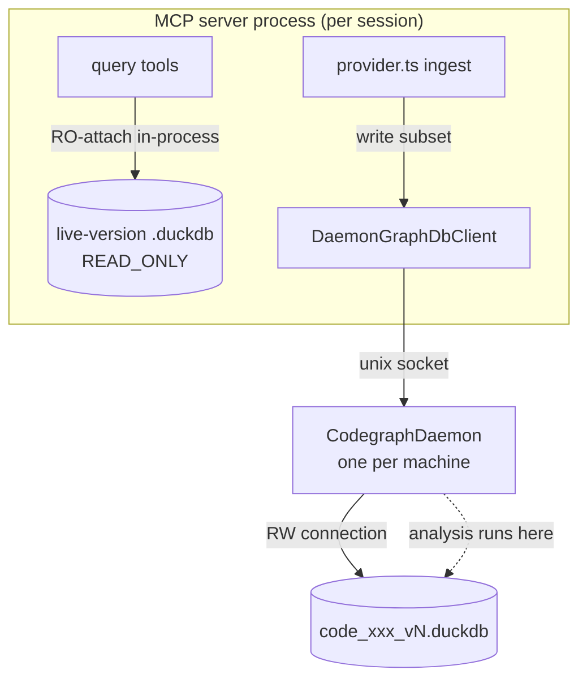

# Codegraph DuckDB Daemon — Design Spec

**Date:** 2026-05-26 **Status:** Approved (brainstorm) — pending implementation
plan **Scope:** Lock fix only. Memory (30 GB) elimination is a separate
follow-up epic.

## Problem

The codegraph layer stores per-collection graph data in DuckDB files at
`<dataDir>/codegraph/<collection>.duckdb`. **DuckDB is single-writer per file**:
exactly one process may hold a read-write connection; cross-process writes take
an exclusive file lock.

In practice multiple Claude sessions run in parallel, each spawning its own
`tea-rags` MCP server process. When two of them touch the same project's
codegraph DB, the second fails:

```text
Could not set lock on file ".../code_27622aef.duckdb":
Conflicting lock is held in node (PID 22310)
```

(`adapters/duckdb/errors.ts:25` already documents this; the second process then
disables the collection — silent degradation.)

The per-collection pool (`GraphDbClientPool`, commit `e8d96a55`) only narrows
the lock **within a single process / across projects**. Same-project
cross-process contention remains.

A secondary, related observation: indexing taxdome bloated a node process to
**~30 GB RSS** in the JS-heap graph-analysis phase
(`collectAdjacency → tarjanScc → pageRank` in `codegraph/symbols/provider.ts`).
That is an **algorithmic** memory problem, not a placement problem — see
Non-Goals.

## Goals

1. Eliminate cross-process DuckDB lock contention for codegraph.
2. Mirror the existing zero-downtime versioned-swap model used by Qdrant
   force-reindex (build new, swap, delete old) for the codegraph DB.
3. Keep `provider.ts` and the MCP query tools essentially unchanged — swap the
   behavior in behind `GraphDbClientPool`.
4. Reuse the repo's established daemon conventions
   (`adapters/qdrant/embedded/daemon.ts`, `daemon-lock.ts`: unix socket,
   refcount, idle-shutdown).

## Non-Goals (explicit)

- **Eliminating the 30 GB analysis allocation.** Moving the analysis into the
  daemon changes _which process_ holds the RAM and the lock, not _how much_ the
  algorithm allocates. Elimination requires an algorithm change (streaming
  Tarjan / DuckDB recursive CTE / edge-explosion cap) and must be driven by a
  heap measurement first (consumer not yet pinned — 30 GB exceeds the naive
  adjacency-map estimate). Tracked as a **follow-up epic**, see below.
- What the daemon _does_ give for memory: peak machine usage drops from
  `N × 30 GB` (N parallel sessions each building) to `1 × 30 GB` (only the
  daemon builds). The analysis is isolated into a single daemon-side method so
  the future fix lands in one place.

## Architecture

### Components

| Component                                                | Process                  | Responsibility                                                                                                                                                                       |
| -------------------------------------------------------- | ------------------------ | ------------------------------------------------------------------------------------------------------------------------------------------------------------------------------------ |
| `CodegraphDaemon`                                        | new, **one per machine** | Owns all `code_*.duckdb` RW connections (opened lazily per collection-version). Serves the write/analysis protocol over a unix socket. Runs the heavy graph analysis locally.        |
| `DaemonGraphDbClient`                                    | MCP server (client)      | Implements the **write subset** of `GraphDbClient`; proxies each call over the socket. Returned by `GraphDbClientPool` for the write path.                                           |
| RO handle (`DuckDbGraphClient`, `access_mode=READ_ONLY`) | MCP server (in-process)  | Read path. Multiple processes may open the same file read-only concurrently. New `access_mode` option on `DuckDbGraphClientOptions` (today `client.ts:92` opens RW unconditionally). |
| `GraphDbClientPool`                                      | MCP server               | The seam. Becomes **version-aware** (resolve live version from the Qdrant collection name) and **mode-aware** (RW → daemon, RO → in-process).                                        |

### Narrow IPC protocol

Only mutations and the heavy analysis cross the socket. Reads do **not**.

| Message                                               | Direction       | Notes                                                                                                                                                                                                                                              |
| ----------------------------------------------------- | --------------- | -------------------------------------------------------------------------------------------------------------------------------------------------------------------------------------------------------------------------------------------------- |
| `handshake` / `healthcheck`                           | client → daemon | lifecycle                                                                                                                                                                                                                                          |
| `upsertFile(collection, node, edges)`                 | client → daemon | one call per file; O(1) client memory (edges already capped at `MAX_EDGES_PER_FILE=10000`)                                                                                                                                                         |
| `removeSymbolsForFile(collection, relPath)`           | client → daemon | delete-hook                                                                                                                                                                                                                                        |
| `computeAndPersistCyclesAndSignals(collection)`       | client → daemon | daemon runs `collectAdjacency → tarjanScc → pageRank → replaceCycles` **locally** against its own RW connection. Adjacency is never streamed over IPC — the 30 GB stays in the daemon. Replaces the local analysis block at `provider.ts:893-898`. |
| `checkpoint(collection)`                              | client → daemon | WAL bound                                                                                                                                                                                                                                          |
| `finalizeReindex(collection, oldVersion, newVersion)` | client → daemon | post-swap: close + delete old version file                                                                                                                                                                                                         |

Read operations (`get_callers`, `get_callees`, `find_cycles`) are served by the
in-process RO handle and are intentionally absent from the protocol.

### Data flow



| Path                            | Behavior                                                                                                                                                                                                                                      |
| ------------------------------- | --------------------------------------------------------------------------------------------------------------------------------------------------------------------------------------------------------------------------------------------- |
| **Read** (queries)              | RO-attach in-process on the live version (resolved via Qdrant alias). Many readers coexist.                                                                                                                                                   |
| **Write / incremental reindex** | through the daemon; daemon holds RW on `code_xxx_vN.duckdb` and writes in place. Reads of _that_ collection block for the (short) incremental window.                                                                                         |
| **Force reindex**               | daemon builds a **new** `code_xxx_v(N+1).duckdb`; readers stay on `_vN` (RO); Qdrant alias swaps atomically to `_v(N+1)`; daemon deletes `_vN.duckdb` via `finalizeReindex`. **Zero read downtime, crash-safe** (old file intact until swap). |

## Versioning & atomic swap

- **Remove `stripVersionSuffix`** (`provider.ts:141`, called at `:525`). The
  codegraph DB file name becomes the **full Qdrant collection name**
  (`code_xxx_vN.duckdb`), not the stripped stable name.
- The **Qdrant alias is the single source of truth** for the live version. No
  separate pointer file or symlink. Incremental reindex keeps the same
  collection name → same file (in place); force-reindex creates a new `_v(N+1)`
  collection → new file.
- The atomic swap already exists on the Qdrant side
  (`adapters/qdrant/aliases.ts:switchAlias`). Codegraph readers follow the alias
  on their next acquire; the daemon deletes the superseded DB file after the
  swap is confirmed.

## Lifecycle

Mirror `adapters/qdrant/embedded/daemon.ts`:

- **Spawn on demand** — first write acquire with no live daemon spawns it
  (refcounted, `daemon-lock.ts`-style single-spawn guard).
- **Refcount** — MCP processes register/deregister; daemon idle-shuts-down when
  the last client disconnects and no work is in flight (after a grace window).
- **Migrations / hydration** run daemon-side at file-open (the daemon owns the
  RW connection, so it owns schema migration too).
- **Crash handling** — daemon dies → clients detect socket close → write path
  degrades to the existing "collection disabled in this process" behavior
  (`errors.ts:25`); read path is unaffected (independent RO attach). Next write
  respawns the daemon.

## Integration seam

The only structural change outside the new daemon module is in
`GraphDbClientPool`:

- resolve the live collection version (un-strip),
- return a `DaemonGraphDbClient` for writes and an RO `DuckDbGraphClient` for
  reads.

`provider.ts` changes only its analysis block (local
`collectAdjacency/tarjanScc/pageRank` → one `computeAndPersistCyclesAndSignals`
RPC). MCP query tools are untouched. The pure functions in
`codegraph/infra/tarjan-scc.ts` and `page-rank.ts` execute inside the daemon.

## Risk signals (tea-rags)

All target files are **deep-silo** (Arthur Korochansky, 100% blame) —
`adapters/duckdb/*`, `adapters/qdrant/embedded/daemon.ts`. Per
`.claude/rules/silo-pairing.md`, every commit touching them MUST carry a `Why:`
line. Hotspots with recent churn: the `duckdb/client.ts` cluster (`init`,
`openCollection`) — the integration points the daemon wraps.

## Testing strategy

- **Daemon lifecycle** unit tests mirroring
  `tests/.../qdrant/embedded/daemon.test.ts` (spawn, refcount, idle-shutdown,
  socket handshake).
- **Protocol round-trip** tests: `upsertFile` / `removeSymbolsForFile` /
  `computeAndPersistCyclesAndSignals` over a real socket against a temp DB.
- **Pool routing** tests: RW acquire → daemon client; RO acquire → in-process
  READ_ONLY handle; version resolution (un-strip) picks the live file.
- **Concurrency** test: two clients reading the same built collection coexist; a
  writer + reader on the same collection serialize as expected.
- **Force-reindex swap** test: build `_v(N+1)` while reading `_vN`, swap, old
  file deleted, readers follow.
- Existing `tests/core/adapters/duckdb/client.test.ts` and codegraph provider
  tests stay green (business-logic tests immutable; only the analysis call site
  changes).

## Follow-up epic (out of scope here)

**Eliminate the 30 GB codegraph analysis allocation.**

1. Measure heap on a real taxdome codegraph run
   (`--heapsnapshot-near-heap-limit` plus phase-boundary
   `process.memoryUsage()`), splitting JS-heap vs native RSS, to pin the
   consumer (adjacency map vs V8 string-key overhead vs edge explosion).
2. Fix the algorithm inside the daemon's `computeAndPersistCyclesAndSignals`:
   streaming Tarjan with disk-backed state, and/or push SCC + PageRank into a
   DuckDB recursive CTE (DuckDB spills natively — `.spill` already exists),
   and/or cap/exclude edge-exploding files.

Related: `tea-rags-mcp-lrkq` (Streaming Tarjan SCC + PageRank for >50k edges).
