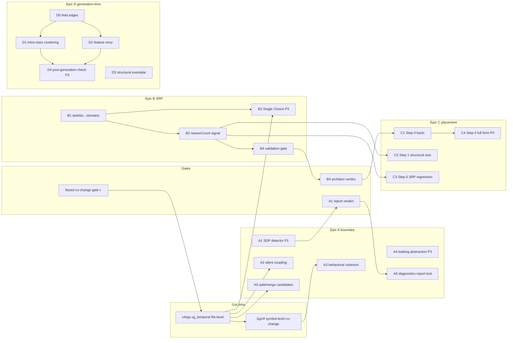

# Architecture-Aware Code Intelligence — Program Design (89k7k)

- **Date:** 2026-08-06
- **Program:** `tea-rags-mcp-89k7k` — measure boundaries, responsibilities,
  placement
- **Status:** approved phasing; Phase 0 designed in detail, Phases 1–2 sketched
- **Decisions locked in this session:** gate-first phasing; reasons derived from
  "intent units" via a three-rung source cascade (taskIds → conventional scopes
  → sessions) with bipartite clustering where units need merging (Jira adapter
  reserved as second chance for the ticket rung)

## Problem

tea-rags answers WHERE code is (search), HOW it connects (codegraph), and HOW
RISKY it is (trajectory). It does not answer whether code is DECOMPOSED
CORRECTLY, nor WHERE new code belongs. This program adds that third question.

Core insight: Martin's SRP is a temporal category (reasons to change), not a
structural one. Every published SRP metric (LCOM, size, fanOut) is a structural
surrogate because reasons-to-change are invisible in source. They are visible in
history — the one dataset tea-rags has and competitors do not.

## Hard limit (must appear in every artifact of this program)

The tool can show an abstraction is bad; it cannot say which one is good,
because correctness of a boundary is defined by future change, which is not in
the repo. **Diagnosis yes, prescription no.** Every detector emits hypotheses
with evidence (N of M commits, both instability values), never instructions.

## Program graph

21 nodes: 19 program tasks + 2 infrastructure nodes from epic `l1ot` (temporal
coupling).

**Entry points (no dependencies):** A1, B1, D0, D3, A4.

**Three gates control 9 of 19 tasks:**

| Gate                  | Decision rule                                    | Controls                               |
| --------------------- | ------------------------------------------------ | -------------------------------------- |
| `9szed` (in progress) | top-3 hit rate >50% promotes, <25% closes        | x4rpp, 3gz4f → A2, A3, A5, B3          |
| A1 report verdict     | architect recognizes real defects, or not        | premise of A2–A5 (build vs reconsider) |
| `B4`                  | agreement ≥2/3 passes, <1/3 closes with a number | C1; value of C2/C3                     |

The program is gate-first by construction — the beads encode it; the phasing
follows it rather than fighting it.

## Facts that shaped the ordering

- **B-validation runs on two corpora with different intent sources.** taxdome
  has ticket discipline (TD-\*); tea-rags has no taskIds (payload `taskIds`
  empty; `DEFECT-1`/`#1` are test artifacts) but has commitlint-enforced
  conventional scopes — it validates via the scope rung of the B1 cascade. Two
  independent measurements of one mechanism through different sources make the
  B4 gate stronger than a single-corpus run.
- **A1 is pure SQL over DuckDB.** Instability derives from the file-edge table
  by aggregation; no Qdrant reads. Genuinely the cheapest detector in the
  program.
- **D3 is nearly free.** The `decomposition` rerank preset already exists; D3 is
  a second query shape in data-driven-generation Step 2 on top of it.
- **D0 is the riskiest single task.** It lands in `CodegraphEnrichmentProvider`
  (79 commits, changeDensity 31.91 intense, 1590 lines) and the Ruby walker
  (hub, fanIn 7, transitiveImpact 24, 2380 lines), plus a schema migration and a
  force-reindex cycle. Mitigations: field edges follow the same extraction-sink
  seam as method edges (post-G2 split); Ruby `@ivar` knowledge partially exists
  in the `ruby-ivar-field` resolver strategy.
- **C4 is blocked by a nonexistent epic** (commit indexing). File that epic
  first, then park C4.

## Phasing (approved)

### Phase 0 — three validators in parallel (scripts, zero production code)

Pattern: forensics harness (9szed / G0 VTA oracle). Cost: 2–4 burst days.
Output: three numbers before any production investment.

- **V-A** — A1 SDP script → report on tea-rags + taxdome → architect verdict
- **V-B** — B1+B2 prototype → reasonCount top offenders on taxdome → B4 verdict
- **V-T** — 9szed completes (already in progress in a parallel session)

### Phase 1 — production per passed gate + independent track D

- Track D starts immediately after Phase 0; no gate touches it: D0 → D1/D2, with
  D3 in parallel.
- V-A pass → A1 production detector + A6 (MCP tool + skill, thin: ships with A1
  alone, later detectors extend the same report).
- B4 pass → B1/B2 as payload signals → C2/C3 (cheap skill edits) → C1.
- 9szed pass → x4rpp → A2/A5 → extend A6 report.

### Phase 2 — tail

- 3gz4f → A3 (closes the boundary set)
- D4 (closes the generation loop)
- P3 tail cut by default: A4, B3, C4 (file the commit-indexing epic, park C4)

## Phase 0 detailed design

### V-A: SDP violation script

- **Location:** `scripts/` following the recall-forensics harness pattern.
- **Data:** codegraph DuckDB of the current indexes (tea-rags, taxdome). File
  instability I = fanOut / (fanIn + fanOut) computed by aggregation over the
  file-edge table in the query itself.
- **Rule:** for every edge A→B (A depends on B), violation when
  `I(B) − I(A) > tolerance`. Tolerance configurable, default 0.2 (bead value —
  avoids noise from near-equal pairs).
- **Output:** violating edges with both instability values, delta, sorted by
  delta descending; markdown + JSON report.
- **Verdict protocol (gate A):** architect reads the top of both reports. If
  nothing is recognizable as a real defect, epics A2–A5 are reconsidered before
  any temporal investment; A6 still ships (SDP-only) if A1 alone proves useful,
  else the boundary line stops.

### V-B: reasonCount prototype (B1+B2 compressed into one script)

- **Extraction (B1):** `git log` over the trajectory window (12 months, same as
  `TRAJECTORY_GIT_LOG_MAX_AGE_MONTHS`). Exclude mass commits (>15 files — same
  rule 9szed uses; mass refactors poison pairs).
- **Intent units — source cascade (amended in review):** the clustering key is a
  _unit of intent_ — a group of commits made for one purpose. Tickets are the
  strongest source of units, not the mechanism itself. Three rungs, selected per
  repo by coverage over the window:
  1. **taskIds** (existing JIRA / GitHub / Azure trajectory patterns) — unit =
     ticket. Best unit boundaries and best names.
  2. **Conventional-commit scope** (`feat(codegraph):`) — a scope IS a
     self-declared reason label; no clustering needed on this rung, reasons =
     normalized scopes. Highest circularity (scopes mirror layout), but a
     self-declared domain taxonomy is exactly what SRP counts.
  3. **Sessions** (author + time-gap bundles, squash-aware — already computed by
     the git trajectory) — the universal floor: every repo has them. A single
     session is a noisy unit; clustering merges recurring sessions over the same
     file neighborhoods into themes. Rungs 1 and 3 feed bipartite clustering
     over the unit↔file graph — units whose file-sets overlap heavily form one
     "reason" community. **Known caveat (must appear in the report):** partial
     circularity — directory layout influences the communities used to judge the
     layout; maximal on the scope rung. The report always names the source used
     and its coverage %; below a coverage floor the verdict is "insufficient
     signal", never confident numbers. The mapper stays a pluggable interface; a
     Jira component/epic/label adapter is the designated second chance for the
     ticket rung if B4 lands in the failure band.
- **Metric (B2):** reasonCount(file) = number of distinct reasons (communities
  on rungs 1/3, normalized scopes on rung 2) among commits touching the file,
  with a support floor (a reason counts only with ≥2 commits on that file) to
  suppress drive-by noise. reasonCount carries source-based confidence (ticket >
  scope > session) — same philosophy as per-signal confidence dampening.
- **Output:** top-20 offenders with named reasons — each labeled by dominant
  paths plus a sample of ticket IDs / scopes / session digests, with per-file
  commit counts per reason and the source + coverage header.
- **Verdict protocol (B4):** architect reviews the top-20 on BOTH corpora —
  taxdome (ticket rung) and tea-rags (scope rung). Per corpus: agreement ≥2/3 →
  measurement tracks the concept, epic C consumes it. <1/3 on the ticket rung →
  try the Jira adapter once; if still <1/3, close epics B and C-basic with the
  number. Between bands → refine filters, re-measure once.
- **Degradation disclosure:** the report always prints intent-source coverage; a
  repo below the floor on all three rungs gets "insufficient signal" — the
  quality of names and unit boundaries degrades down the cascade, and that
  degradation is quantified rather than silent.

### V-T: 9szed

Already in progress; decision rule stands as written in the bead (top-3 >50%
promote / <25% close / between → refine once).

## Incremental-indexing model for production B1/B2 (Phase 1)

Clustering is a global computation over the unit↔file graph (unit = ticket /
scope / session per the B1 cascade), while incremental reindex re-enriches only
changed files — the same tension codegraph signals already resolved (a commit to
file A changes fanIn of file B). The production form mirrors that architecture:

1. **Accumulate edges incrementally, never clusters.** A delta commit-walk
   (since last indexed commit) appends `(intentUnit, file, commitTime)` rows to
   a DuckDB table under the `cg_*` family. Window eviction (12 months) by commit
   time — same pattern as the git incremental file-signal cache.
2. **Recompute clustering globally at finalize, every run.** No incremental
   community detection: the bipartite graph is small (taxdome-scale: ~10⁴
   tickets, ~10⁴–10⁵ files, low-hundreds-of-thousands edges), label propagation
   / Louvain completes in seconds — same posture as the graph finalizer
   recomputing SCC/PageRank over the full stored graph.
3. **Backfill only changed payloads.** Diff new reasonCount against stored
   values; `set_payload` for files whose value moved — the enrichment backfiller
   seam already does this for codegraph overlays. reasonCount changing on files
   untouched by the delta is legitimate (a community split is new information),
   and backfill is the delivery mechanism.

**Run-to-run partition stability is the real risk, not recompute cost:**

- Community detection is order-sensitive → reasonCount flapping and backfill
  storms. Mitigations: sorted node order + fixed tie-breaking (deterministic for
  unchanged input), the ≥2-commit support floor, mass-commit exclusion. Residual
  drift is monitored: partition Jaccard between runs logged in enrichment
  health.
- **C3 compares within one snapshot only.** "Does this change introduce a new
  reason" = membership of the current task's reason community in the file's
  community set under the current clustering. Cross-run community identity is
  needed nowhere: reasonCount is label-free, report names re-derive from
  dominant paths each run.

**Shared extractor with x4rpp:** if 9szed passes, one delta commit-walk feeds
two sinks — co-change pairs (temporal) and ticket-file edges (reasons). The walk
is not duplicated.

## Not in scope of Phase 0

Production signals, schema migrations, MCP tools, skill edits, reindexes. Every
Phase 1 item gets its own spec → plan → implementation cycle once its gate
passes.

## Forecast (PROGRAM class, substrate-exists ×0.5–0.7, codegraph 3-week anchor)

- Phase 0: 2–4 burst days → within one week.
- Full program, all gates passing: ~10–14 burst days → **P25 3 wk / P50 4 wk /
  P75 5.5 wk** calendar at the usual 2–4 parallel epics.
- If 9szed or B4 cuts branches: program shrinks to A1/A6 + track D → ~2–3 weeks.

## Beads mapping

Phase 0 validators are the script-shaped portions of existing beads: V-A ⊂
`thc7s` (A1), V-B ⊂ `psh3j`+`ku1s9` (B1+B2) with the verdict being `d3dfo` (B4),
V-T = `9szed`. On execution, mark those beads in_progress; production halves
stay open until Phase 1. No new beads needed for Phase 0.
